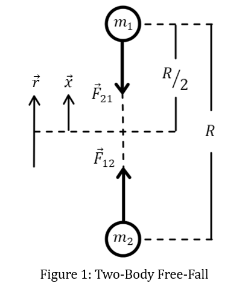

# Two-Body Gravitational Free Fall

Part 1: Starting with Conservation of Energy

$$KE_{i} + PE_{i} = KE_{f} + PE_{f}$$

For the entire process:

$$\frac{1}{2}m_{1}v_{1i}^{2} + \frac{1}{2}m_{2}v_{2i}^{2} + m_{1}gh_{1i} + m_{2}( - g)h_{2i} = \frac{1}{2}m_{1}v_{1f}^{2} + \frac{1}{2}m_{2}v_{2f}^{2} + m_{1}gh_{1f} + m_{2}( - g)h_{2f}
$$

Since both masses are the same, they are both initially at rest, and both will have the same final speed by symmetry,

$$mgh_{1i} - mgh_{2i} = \frac{1}{2}mv_{f}^{2} + \frac{1}{2}mv_{f}^{2} + mgh_{1f} - mgh_{2f}$$

$$gh_{1i} - gh_{2i} = v_{f}^{2} + gh_{1f} - gh_{2f}$$

When the masses meet and exhaust their potential energies:

$$gh_{1i} - gh_{2i} = v_{f}^{2}$$

$$g\left( \frac{R}{2} \right) - g\left( - \frac{R}{2} \right) = v_{f}^{2}$$

So, their final speed is:

$$v_{f} = \sqrt{gR}$$

Where $g$ is:

$$F = G\frac{mm}{R^{2}} = G\frac{m^{2}}{R^{2}}$$

And

$$F = mg = G\frac{m^{2}}{R^{2}} \rightarrow g = \frac{Gm}{R^{2}}$$

So, "falling" from a max height of $R$,

$$v_{f} = \sqrt{\frac{Gm}{R}}$$

For the case of two $0.149\ kg$ baseballs separated by $R = 1\ m$,

$$v_{f} = 3.153 \times 10^{- 6}\ m/s$$

But to solve the time to fall using this velocity is tricky\...

Employing kinematics will be inaccurate because the acceleration changes as a function of the separation distance and is not constant! Let's see what would happen anyway:

$$y = y_{o} + v_{oy}t - \frac{1}{2}gt^{2}$$

Applying this to one of the masses which travels over a distance of $\frac{R}{2}$,

$$0 = \frac{R}{2} - \left( \frac{1}{2} \right)\left( \frac{Gm}{R^{2}} \right)t^{2}$$

$$R = \frac{Gmt^{2}}{R^{2}}$$

$$t^{2} = \frac{R^{3}}{Gm}$$

$$t = \sqrt{\frac{R^{3}}{Gm}}$$

$$t = 317207.87\ s$$

$$t = \mathbf{3.67\ }\mathbf{days}$$

This is a reasonable approximation, but not accurate since the acceleration is not constant as the separation distance changes. So how would that be accounted for? And how can a changing acceleration then be related to time?

Part 2: Consider the work done by gravity to accelerate one mass over some distance,

$$W = Fd$$

$$dW = Fdx$$

$$W = \int Fdx$$

The work done is also related to the change in kinetic energy and potential energy as

$$W = \Delta KE = - \Delta PE$$

Since acceleration due to gravity on Earth is assumed to be linear and constant, the familiar relationship of potential energy $mgh$ is no longer accurate (it is shown at the end that this is a first order approximation of $PE = - \frac{Gm_{1}m_{2}}{r} = - \frac{Gm^{2}}{r}$)

$$- \Delta PE = - \left( PE_{f} - PE_{i} \right) = \int Fdx$$

$$PE_{i} = \int Fdx$$

Considering that both masses move from a "height" $\frac{R}{2} > x > 0$ which reduces the separation distance $r = 2x$, such that $R > r > 0$. Then the potential energy for one of the masses as a function of separation distance can be found by integrating the force over the separation distance, using $x = \epsilon \rightarrow 0$ to avoid a singularity as $x = 0$.

$$PE = \int_{r_{i}}^{r_{f}}{\frac{Gm^{2}}{r^{2}}dr} = Gm^{2}\int_{R}^{\epsilon}{\frac{1}{r^{2}}dr} = Gm^{2}\int_{R/2}^{\epsilon}{\frac{1}{{(2x)}^{2}}dx} = \frac{Gm^{2}}{4}\int_{R/2}^{\epsilon}{\frac{1}{x^{2}}dx}$$

$$PE = \frac{Gm^{2}}{4}\left( - \frac{1}{x} \middle| \frac{R}{2} \rightarrow \epsilon = x \right) = - \frac{Gm^{2}}{4}\left( \frac{1}{x} - \frac{2}{R} \right) = \frac{Gm^{2}}{4}\left( \frac{2}{R} - \frac{1}{x} \right)$$

So as $x \rightarrow 0$, $PE \rightarrow - \infty$, and as $x \rightarrow \frac{R}{2}$, $PE \rightarrow 0$.

Work is performed at the expense of potential energy,

$$W = \Delta KE = - \Delta PE = - \left( PE_{f} - PE_{i} \right) = PE_{i} = \int Fdx = \frac{Gm^{2}}{4}\left( \frac{2}{R} - \frac{1}{x} \right)$$

$$\Delta PE = \frac{Gm^{2}}{4}\left( \frac{1}{x} - \frac{2}{R} \right)$$

$$\Delta KE = \frac{Gm^{2}}{4}\left( \frac{2}{R} - \frac{1}{x} \right)$$

Let's talk about this:

$$\Delta PE = \frac{Gm^{2}}{4}\left( \frac{1}{x} - \frac{2}{R} \right)$$

Potential energy should start out at a maximum and go to a minimum\... so its change should be negative as $x$ DECREASES\... let's see:

$$PE_{\max} = \frac{Gm^{2}}{4}\left( \frac{2}{R} - \frac{1}{x} \right) = \frac{Gm^{2}}{4}\left( \frac{2}{R} - \frac{1}{\frac{R}{2}} \right) = 0$$

$$PE_{\min} = \frac{Gm^{2}}{4}\left( \frac{2}{R} - \frac{1}{0} \right) = - \infty$$

So yes, the change is decreasing\... weird that the start is zero and decays to negative infinity though\... Well, it's because by convention we let the most positive potential energy be zero (not the most negative)!

Then,

$$PE(x) = \frac{Gm^{2}}{4}\left( \frac{2}{R} - \frac{1}{x} \right)$$

$$\Delta PE = \frac{Gm^{2}}{4}\left( \frac{1}{x} - \frac{2}{R} \right)$$

$$W = \Delta KE = - \Delta PE = \frac{Gm^{2}}{4}\left( \frac{2}{R} - \frac{1}{x} \right)$$

And for $x = \frac{r}{2}$, as $r = 2x$, then,

$$W = \Delta KE = - \Delta PE = \frac{Gm^{2}}{4}\left( \frac{2}{R} - \frac{2}{r} \right) = \frac{Gm^{2}}{2}\left( \frac{1}{R} - \frac{1}{r} \right)$$

Relating back to velocity through kinetic energy for one of the masses,

$$KE_{f} - KE_{i} = \frac{Gm^{2}}{2}\left( \frac{1}{R} - \frac{1}{r} \right)$$

Since the initial kinetic energy is zero,

$$\frac{1}{2}mv_{f}^{2} = \frac{Gm^{2}}{2}\left( \frac{1}{R} - \frac{1}{r} \right)$$

And since the masses are the same and their velocities symmetrical,

$$mv_{f}^{2} = Gm^{2}\left( \frac{1}{R} - \frac{1}{r} \right)$$

The velocity is more generally given by the following expression.

$$v_{f} = \sqrt{Gm\left( \frac{1}{R} - \frac{1}{r} \right)}$$

Which, for $r \ll R$,

$$v_{f} = \sqrt{\frac{Gm}{R}}$$

As found before! This is effectively an asymptotic upper bound for the velocity, though formally it diverges as does the force at $r = 0$, ($v_{f} \rightarrow \infty$ and $F \rightarrow \infty$). What this implies is that the particle must not be a particle but an object with size and shape (finite radius).

So now that we have a more formal expression of velocity and potential energy, how does this help us solve time? Despite both diverging to infinity as the zero-limit, the time remains finite. Let's check it out!

$$v = \frac{dx}{dt} \rightarrow dt = \frac{dx}{v}$$

$$t = \int dt = \int_{}^{}\frac{1}{v(x)}dx = \int_{\frac{R}{2}}^{0}{\frac{1}{\sqrt{Gm\left( \frac{1}{R} - \frac{1}{2x} \right)}}dx} = \frac{1}{\sqrt{Gm}}\int_{0}^{\frac{R}{2}}{\frac{1}{\sqrt{\frac{1}{2x} - \frac{1}{R}}}dx}$$

Using a change of variable to simplify the integral, let $x = \frac{R}{2}\sin^{2}\theta$ and $dx = Rsin\theta cos\theta d\theta$,

$$\frac{1}{2x} - \frac{1}{R} = \frac{1}{Rsin^{2}\theta} - \frac{1}{R} = \frac{1 - sin^{2}\theta}{Rsin^{2}\theta} = \frac{cos^{2}\theta}{Rsin^{2}\theta}$$

The bounds change as

$$0 \rightarrow 0 = \frac{R}{2}\sin^{2}\theta \rightarrow \sin^{2}\theta = 0 \rightarrow \theta = 0$$

And

$$\frac{R}{2} \rightarrow \frac{R}{2} = \frac{R}{2}\sin^{2}\theta \rightarrow \sin^{2}\theta = 1 \rightarrow \theta = \pi/2$$

Then,

$$t = \frac{1}{\sqrt{Gm}}\int_{0}^{\frac{\pi}{2}}{\frac{1}{\sqrt{\frac{cos^{2}\theta}{Rsin^{2}\theta}}}Rsin\theta cos\theta d\theta} = \frac{1}{\sqrt{Gm}}\int_{0}^{\frac{\pi}{2}}{\frac{1}{\frac{cos\theta}{\sqrt{R}sin\theta}}Rsin\theta cos\theta d\theta} = \frac{R\sqrt{R}}{\sqrt{Gm}}\int_{0}^{\frac{\pi}{2}}{sin^{2}\theta d\theta}$$

Since $\int_{0}^{\frac{\pi}{2}}{sin^{2}\theta d\theta} = \frac{\pi}{4}$, then, the time to "fall" together is:

$$t = \frac{\pi}{4}\sqrt{\frac{R^{3}}{Gm}}\ $$

This is only valid for the special case where both masses are equal. For two baseballs, idealized as particles, weighing about $0.149\ kg$ and separated by $1\ m$, the "falling" time is

$$t = 249134.476\ s$$

$$t = \mathbf{2.884\ }\mathbf{days}$$

Let's see if we can verify this result from another perspective, using relative motion.

Part 3: Following a somewhat more rigorous **Classical Mechanics** approach:

From Newton's Second Law:

$$m_{1}{\overrightarrow{a}}_{1} = {\overrightarrow{F}}_{12}$$

$$m_{2}{\overrightarrow{a}}_{2} = {\overrightarrow{F}}_{21} = - {\overrightarrow{F}}_{12}$$

Which can also be expressed as time-rates-of-change of a relative position vector

$$\overrightarrow{r} = {\overrightarrow{r}}_{1} - {\overrightarrow{r}}_{2}$$

So, the relative velocity is given by,

$$\dot{\overrightarrow{r}}\  = {\dot{\overrightarrow{r}}}_{1} - {\dot{\overrightarrow{r}}}_{2}$$

And the relative acceleration as,

$$\ddot{\overrightarrow{r}} = {\ddot{\overrightarrow{r}}}_{1} - {\ddot{\overrightarrow{r}}}_{2}$$

Then, by Newton's Second Law,

$$m_{1}{\ddot{\overrightarrow{r}}}_{1} = {\overrightarrow{F}}_{12}$$

$$m_{2}{\ddot{\overrightarrow{r}}}_{2} = {\overrightarrow{F}}_{21} = - {\overrightarrow{F}}_{12}$$

So, the relative acceleration is,

$$\ddot{\overrightarrow{r}} = \frac{{\overrightarrow{F}}_{12}}{m_{1}} - \frac{{\overrightarrow{F}}_{21}}{m_{2}} = \frac{{\overrightarrow{F}}_{12}}{m_{1}} - \frac{- {\overrightarrow{F}}_{12}}{m_{2}} = \frac{{\overrightarrow{F}}_{12}}{m_{1}} + \frac{{\overrightarrow{F}}_{12}}{m_{2}}$$

$$\ddot{\overrightarrow{r}} = {\overrightarrow{F}}_{12}\left( \frac{1}{m_{1}} + \frac{1}{m_{2}} \right) = {\overrightarrow{F}}_{12}\left( \frac{m_{2}}{m_{1}m_{2}} + \frac{m_{1}}{{m_{1}m}_{2}} \right) = {\overrightarrow{F}}_{12}\left( \frac{m_{1} + m_{2}}{{m_{1}m}_{2}} \right)$$

And the force,

$${\overrightarrow{F}}_{12} = \left( \frac{{m_{1}m}_{2}}{m_{1} + m_{2}} \right)\ddot{\overrightarrow{r}}$$

Let $\mu = \frac{{m_{1}m}_{2}}{m_{1} + m_{2}}$ be the reduced mass, then, the reduced force is,

$$\overrightarrow{F}(r) = \mu\ddot{\overrightarrow{r}}$$

Note that if the masses are equal,

$$\ \mu = \frac{{m_{1}m}_{2}}{m_{1} + m_{2}} = \frac{m^{2}}{2m} = \frac{m}{2}$$

Now, relating the force to Newton's Universal Law of Gravitation,

$$\overrightarrow{F}(r) = \mu\ddot{\overrightarrow{r}} = - \frac{Gm_{1}m_{2}}{r^{2}}\widehat{r}$$

Which behaves like a single mass, $\mu$, orbiting a fixed center of reference at a radius, $r$.

Relating this force to potential energy, $U$,

$F = - \nabla U(r)$ and $U = - \int\overrightarrow{F} \bullet d\overrightarrow{r}$

Then, using dummy variable $r'$, and integrating from infinity (U = 0) to a target distance $r$,

$$U = - \int_{\infty}^{r}{\frac{- Gm_{1}m_{2}}{r^{'2}}dr^{'}}$$

$$U = \ Gm_{1}m_{2}\int_{\infty}^{r}{\frac{1}{r^{'2}}dr^{'}} = Gm_{1}m_{2}\left( - \frac{1}{r'} \middle| \infty \rightarrow r \right) = - Gm_{1}m_{2}\left( \frac{1}{r} - \frac{1}{\infty} \right) = - \frac{Gm_{1}m_{2}}{r}\ \ \ $$

Thus, the potential energy as a function of separation distance is given by,

$$U(r) = - \frac{Gm_{1}m_{2}}{r}$$

Now, relating potential energy to kinetic energy to obtain velocity as a function of separation distance and then integrating to obtain time.

$$KE_{i} + PE_{i} = KE_{f} + PE_{f}$$

$$- \frac{Gm_{1}m_{2}}{R} = \frac{1}{2}\mu{\dot{r}}^{2} - \frac{Gm_{1}m_{2}}{r}$$

$$\frac{1}{2}\mu{\dot{r}}^{2} = Gm_{1}m_{2}\left( \frac{1}{r} - \frac{1}{R} \right)$$

$$\dot{r} = \sqrt{\frac{2Gm_{1}m_{2}}{\mu}\left( \frac{1}{r} - \frac{1}{R} \right)} = \sqrt{\frac{2Gm_{1}m_{2}}{\frac{{m_{1}m}_{2}}{m_{1} + m_{2}}}\left( \frac{1}{r} - \frac{1}{R} \right)} = \sqrt{2G\left( m_{1} + m_{2} \right)\left( \frac{1}{r} - \frac{1}{R} \right)}$$

So, the velocity as a function of separation distance is,

$$\dot{r} = \sqrt{2G\left( m_{1} + m_{2} \right)\left( \frac{1}{r} - \frac{1}{R} \right)}$$

And,

$$\dot{r} = \frac{dr}{dt} \rightarrow dt = \frac{dr}{\dot{r}}$$

Then, to find time -- integrate:

$$t = \int_{0}^{t}{dt} = \int_{0}^{R}\frac{dr}{\sqrt{2G\left( m_{1} + m_{2} \right)\left( \frac{1}{r} - \frac{1}{R} \right)}} = \frac{1}{\sqrt{2G(m_{1} + m_{2})}}\int_{0}^{R}\frac{dr}{\sqrt{\frac{1}{r} - \frac{1}{R}}}$$

Performing a similar change of variable, since $r = 2x$, let $r = R\sin^{2}\theta$ and $dr = 2Rsin\theta cos\theta d\theta$, such that,

$$\frac{1}{r} - \frac{1}{R} = \frac{1}{Rsin^{2}\theta} - \frac{1}{R} = \frac{1 - sin^{2}\theta}{Rsin^{2}\theta} = \frac{cos^{2}\theta}{Rsin^{2}\theta}$$

Just as before, so the integrand becomes,

$$t = \frac{1}{\sqrt{2G(m_{1} + m_{2})}}\int_{0}^{\frac{\pi}{2}}{\frac{2Rsin\theta cos\theta}{\sqrt{\frac{cos^{2}\theta}{Rsin^{2}\theta}}}d\theta} = \frac{2R\sqrt{R}}{\sqrt{2G(m_{1} + m_{2})}}\int_{0}^{\frac{\pi}{2}}{sin^{2}\theta}d\theta = \frac{2R\sqrt{R}}{\sqrt{2G(m_{1} + m_{2})}}\frac{\pi}{4}$$

Then,

$$t = \frac{\pi R\sqrt{R}}{2\sqrt{2G\left( m_{1} + m_{2} \right)}} = \frac{\pi}{2}\sqrt{\frac{R^{3}}{2G\left( m_{1} + m_{2} \right)}}$$

If $m_{1} = m_{2} = m$

$$t = \frac{\pi}{2}\sqrt{\frac{R^{3}}{2G(2m)}} = \frac{\pi}{2}\sqrt{\frac{R^{3}}{4Gm}} = \frac{\pi}{4}\sqrt{\frac{R^{3}}{Gm}}$$

So, finally, the time for two free-falling bodies to collide is given by,

$$t = \frac{\pi}{2}\sqrt{\frac{R^{3}}{2G\left( m_{1} + m_{2} \right)}}$$

And in the special case where $m_{1} = m_{2} = m$,

$$t = \frac{\pi}{4}\sqrt{\frac{R^{3}}{Gm}}$$

## Discussion

Consider how these expressions for the time for two free-falling bodies to collide depends on two things: initial separation distance and mass.

-   As separation increases, fall time *increases superlinearly*, scaling as $\sqrt{R^{3}}$.

-   As mass increases, fall time *decreases*, scaling as $\frac{1}{\sqrt{m_{1} + m_{2}}}$.

This raises a subtle question about inertia: if greater mass increases resistance to acceleration, why do heavier masses fall together faster?

In Newtonian mechanics, mass plays a dual role: it both resists acceleration (inertial mass) and generates gravitational force (gravitational mass). When both masses increase, the gravitational force grows *quadratically* ($F \propto m_{1}m_{2}$), while the inertial resistance only grows linearly per mass. The result is a net increase in mutual attraction, and a shorter fall time.

Contrast this with an Earth-based example, where a constant external force acts on a mass already subject to gravity. The heavier the object, the less it will accelerate. But in the two-body free-fall problem, the attractive force of gravity itself increases with mass. The more massive the bodies, the stronger the force, the larger the acceleration, and the shorter the fall time.

The essential distinction is that the Earth-based example involves an external force acting on an Earth-mass system, whereas the two-body free-fall example involves internal, mutual forces within the system. More mass means more gravitational force, and thus faster acceleration despite greater inertia.

*Note*: All of this assumes the particle has *no size, shape, or volume*. How might including that consideration influence the ToF and other dynamics?

## First-Order Approximation of Gravitational Potential Energy at Earth's Surface

Starting with Newtonian gravitational potential energy,

$$U(r) = - \frac{Gm_{1}m_{2}}{r}$$

Or, more properly labeled to reflect the planet -- satellite system,

$$U(r) = - \frac{GmM}{r}$$

Where $M\ $is the mass of the Earth, $m$ is the mass of an object on or near Earth's surface, and $r$ is the Earth's radius + however high the object is above Earth\'s surface, $r = R_{E} + h$.

So,

$$U\left( R_{E} + h \right) = - \frac{GmM}{R_{E} + h}$$

Assuming $h \ll R_{E}$, the denominator can be expanded as a Taylor series around $h = 0$ (near Earth's surface) via binomial expansion:

$(1 + \epsilon)^{- 1} = 1 - \epsilon + \epsilon^{2} - \epsilon^{3} + \ldots$ $for\ |\epsilon| < 1$

Matching the denominator to the form of $(1 + \epsilon)^{- 1}$:

$$U\left( R_{E} + h \right) = - GmM\left( R_{E} + h \right)^{- 1} = - GmM{R_{E}^{- 1}\left( 1 + \frac{h}{R_{E}} \right)}^{- 1} = - \frac{GmM}{R_{E}}\left( 1 + \frac{h}{R_{E}} \right)^{- 1}$$

So then, let $\epsilon = \frac{h}{R_{E}}$,

$$\frac{1}{R_{E} + h} = \left( 1 + \frac{h}{R_{E}} \right)^{- 1} \cong \frac{1}{R_{E}}\left( 1 - \frac{h}{R_{E}} + \frac{h^{2}}{R_{E}^{2}} - \ldots \right)$$

And thus,

$$U\left( R_{E} + h \right) = - \frac{GmM}{R_{E}}\left( 1 + \frac{h}{R_{E}} \right)^{- 1} \cong - \frac{GmM}{R_{E}}\left( 1 - \frac{h}{R_{E}} + \left( \frac{h}{R_{E}} \right)^{2} - \ldots \right)$$

Expanding the potential energy,

$$U\left( R_{E} + h \right) \cong - \frac{GmM}{R_{E}} + \frac{GmM}{R_{E}^{2}}h - \frac{GmM}{R_{E}^{3}}h^{2} + \ldots$$

Keeping only first-order terms,

$$U\left( R_{E} + h \right) \cong - \frac{GmM}{R_{E}} + \frac{GmM}{R_{E}^{2}}h$$

Defining gravitational potential at Earth's surface as,

$$U_{0} = - \frac{GmM}{R_{E}}$$

$$U(h) \cong U_{0} + \frac{GmM}{R_{E}^{2}}h$$

And recognizing the gravitational acceleration at Earth's surface as,

$$g = \frac{GM}{R_{E}^{2}}$$

Then,

$$U(h) \cong U_{0} + mgh$$

If we take the surface potential $U_{0}$ as the ground (zero) reference, then to first approximation, the gravitational potential energy at or near Earth's surface is given by:

$$U(h) \cong mgh$$

