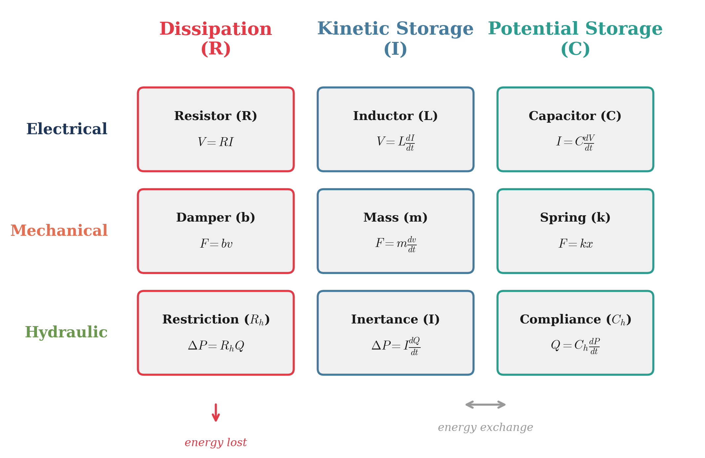
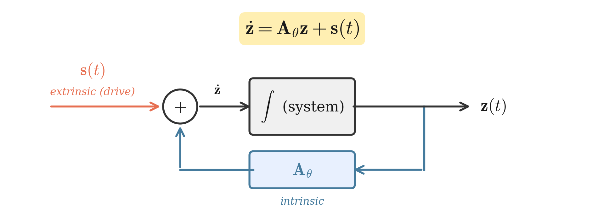
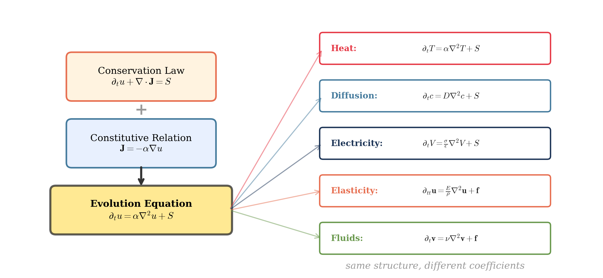
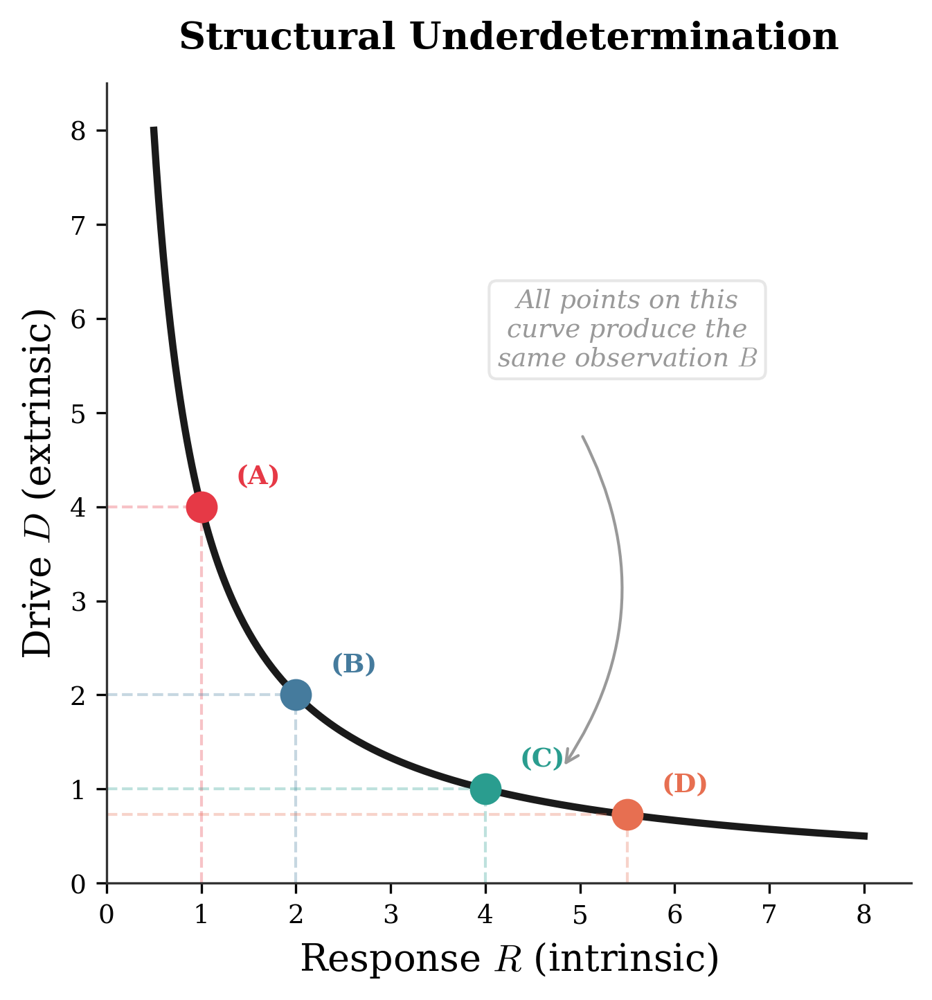

# Abstract {-}

A wide class of physical laws shares a common structure: observable behavior emerges as the product of an intrinsic response and an extrinsic drive. Ohmic conduction, Fourier heat conduction, Fick diffusion, linear elasticity, Newtonian mechanics, and linear response theory [@Onsager_1931] all admit this product form — in the simplest cases, direct multiplication of a material coefficient by a gradient; more generally, the action of an operator on a state. At the field level, constitutive relations combine with conservation laws to yield evolution equations of the form
   
$$\frac{\partial u}{\partial t} = \mathcal{L}_\theta[u] + S(x,t)$$

where $\mathcal{L}_\theta$ is an operator determined by intrinsic structure (diffusivity, conductivity, stiffness, permittivity) and $S$ represents extrinsic sources and boundary drives. This defines an evolution equation on an infinite-dimensional manifold of field configurations whose geometry — modes, curvature, stable and unstable directions — is largely set by intrinsic properties, whereas realized system histories are selected by extrinsic drives and initial conditions.

This interaction structure has direct epistemological consequences. Because the observable is generated by the joint action of intrinsic and extrinsic factors, behavior alone cannot uniquely resolve "how much was the response" versus "how much was the drive" without auxiliary assumptions; causal attributions are **structurally underdetermined** along a nature–nurture axis. The individual ingredients of this framework — constitutive laws and linear response theory [@Onsager_1931], bond-graph power conjugacy [@Paynter_1961; @Karnopp_2012], evolution equations on function spaces [@Pazy_1983], and identifiability analysis — are each well established. What this work contributes is a **unifying narrative**: a continuous logical arc from the constitutive-law observation through cross-domain analogies and operator-form PDEs to a formal demonstration that the interaction structure implies structural underdetermination of causal attributions at every level.

---

# Part I: The Fundamental Pattern

## Why Change Matters

All physical laws describe change (or its absence). Dynamical systems provide a rigorous mathematical framework for these descriptions. The central question: what encourages or resists change in a system? Is the influence intrinsic to the system or imposed by its environment? Perhaps both? And in what proportion?

## Two Laws, One Pattern

Of key significance is the classical relationship between mass, acceleration, and force—described by Newton's Second Law—and the relationship between charge, the electric field, and the electrostatic force—given by Coulomb's Law:

**Newton's Second Law:**
$$F = ma$$

**Coulomb's Law:**
$$F = qE$$

Note both have similar forms, each denoting a force as the product of two interacting components—a *source* (mass $m$, or charge $q$) and a *field* (acceleration $a$, or electric field $E$). As a mnemonic: 'source' + 'field' = 'force'. The generalized force can be expressed as:

$$\boxed{\text{Force} = \text{Source} \times \text{Field}}$$

Force is measured in Newtons in both cases. Mass is measured in kilograms and charge is measured in Coulombs. Thus, the units of acceleration are Newtons per kilogram (m/s²), and the units of the electric field are Newtons per Coulomb (V/m). If the electric field is considered analogous to an acceleration field, then the unit for generalized field strength is:

$$\text{Field} = \frac{\text{Force}}{\text{Source}}$$

In essence, **Sources interact with Fields and experience Forces**, and Forces are the product of an interaction between a Source and a Field.

::: {.callout-note}
**Causal direction varies by domain.** In gravitation and electrostatics, the field ($g$, $E$) exists independently of the test source — it is created by external masses or charges and can be measured without placing a test particle in it. In mechanics, "acceleration" is the *outcome* of the net force on a body, not a pre-existing environmental quantity. Writing $F = ma$ in the Source × Field form is algebraically valid but causally reversed relative to $F = qE$: force *produces* acceleration, whereas an electric field *acts on* a charge. The "Force = Source × Field" template should therefore be understood as a structural pattern whose causal interpretation varies by domain.
:::

## Intrinsic and Extrinsic

**Sources** carry *intrinsic* information: mass, charge, energy, even genetics. **Fields** carry *extrinsic* information about the environment. **Forces** inevitably carry information about both intrinsic and extrinsic properties of the system.

This means that it is not possible to immediately infer whether a force or outcome is due solely to intrinsic or extrinsic properties without a controlled experimental variance of either property to test for such influence.

**An important caveat:** the boundary between "intrinsic" and "extrinsic" is not fixed by nature — it is a modeling choice that depends on where one draws the system boundary. A quantity that is extrinsic to a subsystem (an environmental temperature, a control signal) may become intrinsic once the model is enlarged to include its source. Feedback controllers, coupled subsystems, and back-reaction effects all illustrate how the boundary shifts with the scope of analysis. We adopt the intrinsic/extrinsic decomposition throughout as a productive analytical lens, while acknowledging that it is always relative to a chosen system boundary — a point that merits formal development.

This generalization can be recognized in Lewin's equation describing the behavior of a person in their environment [@Lewin_1936]:

$$B = f(P, E)$$

which is generally stated as:

$$\text{Behavior} = \text{Person} \times \text{Environment}$$

The parallel here is epistemic, not algebraic — it is a recurring *pattern of confounding*, not a claim that psychology obeys the same equations as physics. Just as observing a current density $\mathbf{J}$ cannot, without auxiliary information, resolve how much is due to the conductivity $\sigma$ versus the applied field $\mathbf{E}$, observing a behavior $B$ cannot resolve how much is due to the person $P$ versus the environment $E$. What recurs is the *identifiability barrier*: any interaction of two factors is structurally underdetermined from its output alone. Lewin's equation captures this epistemological point — the "Person" carries intrinsic information (traits, dispositions, genetics); the "Environment" carries extrinsic information (circumstances, context, pressures); and any attempt to attribute the observed Behavior to one or the other without controlled variation is underdetermined for the same structural reason that separating response from drive requires calibration.

## Sources as Field Generators

The preceding examples treat the field as externally given. But sources can also generate fields: a mass creates a gravitational field, a charge creates an electric field, a moving charge generates a magnetic field. The field at any point may itself be the product of other sources.

To explore the nature of this interaction, consider two masses placed a distance $R$ apart. Assuming they are isolated from any other source of mass, the force between them is described by Newton's Universal Law of Gravitation:

$$F = G\frac{mM}{R^2}$$

where $G$ is the universal gravitational constant ($G \approx 6.674 \times 10^{-11}$ N·m²/kg²), $M$ is the larger mass (the "parent" or "planet"), and $m$ is the smaller mass (the "child" or "satellite").

To isolate the effect of the Field on one Source (say, the satellite), rearrange:

$$\frac{F}{m} = G\frac{M}{R^2}$$

Since acceleration is force per mass by Newton's Second Law:

$$g = G\frac{M}{R^2}$$

This says that the acceleration experienced by $m$ is caused by $M$. From the perspective of $m$, the properties of the acceleration field are *extrinsic* and caused by $M$. The force that $m$ experiences in the field also depends on its own *intrinsic* properties—specifically mass. The more massive $m$ becomes, the greater the force it will experience in the same field at the same location.

The same logic applies to Coulomb's Law: $F = k\frac{qQ}{R^2}$. From the perspective of charge $q$, the electric field $E = k\frac{Q}{R^2}$ is extrinsic (created by $Q$), while the force $F = qE$ depends on both the extrinsic field and the intrinsic charge.

**Since Forces are the product of Sources and Fields, they are influenced by both intrinsic and extrinsic properties.**

---

## Structural Pattern of Gravitational and Electrical Fields

The two force laws have an identical mathematical form:

- Gravitational force depends on **mass**: $F_g = m \cdot g = m \cdot \frac{GM_s}{r^2}$
- Electric force depends on **charge**: $F_e = q \cdot E = q \cdot \frac{kQ_s}{r^2}$

The mathematical forms are **identical**. Mass plays the role of charge; $G$ plays the role of $k$. They are the same equation with different labels. Yet textbooks present them as fundamentally different forces—gravity in mechanics courses, electromagnetism in separate courses. This historical accident obscures a structural pattern.

This is no coincidence. Gravity and electricity obey the same mathematical laws up to coupling constants. The cross-domain analogy table in Part V makes the structural correspondence explicit: it follows from power conjugacy and conservation laws, not from heuristic pattern-matching.

For now, note the pattern: **Observable force = (intrinsic property) × (extrinsic field)**. Mass and charge both play the role of "intrinsic property." This suggests they may be more similar than different.

---

# Part II: Potential Energy and Potential

## Spatial Energy

The configuration of a Source in a Field, and its corresponding Force, can also be described via its location within the Field. This description is known as **Potential Energy**—a sort of "spatial energy."

Assuming a uniform acceleration field,

**Gravitational Potential Energy:**
$$U = mgh = Fh$$

where the gravitational force is $F = mg$. The potential energy is a product of Force and Distance, with units of N·m = Joules. The distance $h$ is measured from the field's zero-potential or "ground."

**Electrostatic Potential Energy:**
$$U = qEs = Fs$$

where the electrostatic force is $F = qE$. The potential energy is again a product of Force and Distance, also with units of Joules. The distance $s$ is similarly measured from the field's zero-potential, which is commonly referred to as "ground".

If either a mass or a charge is "elevated" to a non-zero potential, there is stored energy available for release. Upon releasing the mass or charge, it will be driven by a force to follow a trajectory which seeks to minimize this potential energy. The force which develops as a result of this potential energy minimization can be described as the gradient of the potential function:

$$\vec{F} = -\nabla\phi$$

## Potential: Energy per Unit Source

Define **potential** as the ratio of potential energy per source (specific potential energy), such that it is the product of Field and Reference Displacement.

**Gravitational potential:**
$$V_g = \frac{U}{m} = gh$$
Units: Joules per kilogram = m²/s²

Note that gravitational potential has the same units as velocity-squared—a fact directly connected to energy conservation.

**Electric potential (voltage):**
$$V = \frac{U}{q} = Es$$
Units: Joules per Coulomb = Volts

This is the common measurement of voltage, or potential difference. 

::: {.callout-important}
**Key insight:** Potential is purely *extrinsic*—it characterizes the field configuration created by external sources, independent of the test source that might be placed in it.
:::

## Work and Kinetic Energy

Moving a source through a field requires energy—specifically at the expense of potential energy. The energy involved in moving a source from one potential to another is **Work**:

$$W = Fd\cos\theta$$

where $W$ is measured in Joules, $F$ is force in Newtons, $d$ is distance in meters, and $\theta$ is the angle between the applied force and the direction of motion.

More precisely:
$$W = \int \vec{F} \cdot d\vec{r}$$

Since work is the energy which contributes to change in motion along a line of action, this also defines **Kinetic Energy**:

$$W = \Delta KE$$

The change in motion is the result of net work done on the system, from both conservative forces (efficiently transferring energy) and nonconservative forces (inefficiently transferring or removing energy).

**Work by conservative forces:**
$$W_c = \int \vec{F}_c \cdot d\vec{r} = -\Delta PE$$

**Work by nonconservative forces:**
$$W_{nc} = \int \vec{F}_{nc} \cdot d\vec{r}$$

## Energy Conservation

The conservation of energy statement fully describes this exchange:

$$KE_i + PE_i + W_{nc} = KE_f + PE_f$$

Rearranging:
$$W_{nc} = \Delta KE + \Delta PE$$

If all work is conservative ($W_{nc} = 0$):
$$\Delta KE + \Delta PE = 0$$
$$KE + PE = \text{constant}$$

Total mechanical energy is conserved when only conservative forces act.

---

# Part III: The Three Energy Modes

## Classification of Energy Storage and Dissipation

If the energy of a system can be fully described, then its behavior can be described too. The energy of a system can be described with **three energy modes**:

- **Potential energy**: energy *stored in configuration* (position, deformation, separation)
- **Kinetic energy**: energy *stored in motion*
- **Dissipative energy**: energy *lost* to nonconservative effects (friction, drag, resistance)

Each of these three forms represents a **passive role** in the system:

1. Store energy in a potential-like way (compliance, capacitance)
2. Store energy in a kinetic-like way (inertia, inductance)
3. Dissipate energy (resistance, friction)

## RLC Circuit

In a classical RLC circuit, the three passive components are the resistor, inductor, and capacitor:

- **Resistor**: the dissipative element
- **Inductor**: the kinetic storage element (in the magnetic field, and in the inertia-like behavior of current)
- **Capacitor**: the potential storage element (in the electric field, and in charge separation)

Before the circuit is closed, the capacitor is uncharged—there is no voltage across it—and the inductor carries no current. When the switch closes, current begins to flow. The resistor opposes the flow and converts electrical power into heat. The inductor opposes changes in the flow, "pushing back" against sudden jumps in current. The capacitor begins accumulating charge, increasing its voltage.

As the capacitor charges, the voltage across it rises, leaving less potential difference (voltage) across the resistor available to drive current, so current decreases. In the ideal DC limit, current goes to zero once the capacitor reaches the source voltage. The circuit evolves from kinetic activity (current) into potential storage (charge separation), while the resistor continuously bleeds energy away.

## Mass-Spring-Damper

A similar behavior appears in mechanics with the mass-spring-damper system:

- **Damper**: the dissipative element—converts mechanical power into heat through friction-like effects
- **Mass**: the kinetic storage element—stores energy in motion and resists changes in velocity
- **Spring**: the potential storage element—stores energy in deformation and "pushes back" when stretched or compressed

Before anything moves, the spring is undeformed (no spring force) and the mass at rest (no kinetic energy). When the system is disturbed, motion begins. The damper opposes motion, producing a resistive force that scales with velocity. The mass resists rapid changes in velocity (accelerations). The spring builds a restoring force as it stores potential energy.

As spring deformation increases, the restoring force grows, reducing net force available to accelerate the mass. The velocity peaks and falls as the spring pulls the mass back toward equilibrium. The damper steadily bleeds energy, oscillations shrink, and the system settles toward rest.

- The **mass** resists changes in velocity (a mechanical "inductor")
- The **spring** produces a restoring force proportional to displacement (a mechanical "capacitor")
- The **damper** produces a resistive force proportional to velocity (a mechanical "resistor")

## Hydraulic Analog

A similar behavior appears in hydraulics with a restriction–inertance–accumulator system:

- **Restriction** (valve/orifice): the dissipative element—converts mechanical power into heat through viscous losses
- **Inertance** (long pipe / moving slug of fluid): the kinetic storage element—moving fluid has inertia and resists rapid changes in flow (the effect behind water hammer)
- **Compliance** (accumulator with flexible diaphragm): the potential storage element—stores energy by compressing/expanding a volume

Before anything flows, the accumulator is relaxed—no pressure difference across its diaphragm—and the fluid in the inertance pipe is stationary. When a pressure source is applied, fluid begins to move. The restriction opposes flow, converting hydraulic power into heat through viscous friction. The inertance opposes changes in flow rate, resisting sudden accelerations of the fluid column (this is the mechanism behind water hammer—fluid in motion does not stop easily).

As the accumulator fills, its diaphragm stretches and internal pressure rises, leaving less pressure difference available across the restriction to drive flow, so the flow rate decreases. In the steady-state limit, flow goes to zero once the accumulator pressure equals the source pressure. The system evolves from kinetic activity (fluid in motion) into potential storage (pressure in the accumulator), while the restriction continuously bleeds energy away.

Notably absent from this table is the thermal domain. Thermal systems have clear resistance (thermal conductivity opposes heat flow) and compliance (heat capacity stores thermal energy), but lack a standard inertance — there is no widely accepted thermal analog of inductance or mass. The consequence is that thermal systems diffuse rather than oscillate: they are inherently RC systems. Part VII derives the heat equation from this two-step construction, where the missing inertance manifests as the absence of a second time derivative.

::: {.callout-note}
**All three systems share the same structure:** two elements exchange energy back and forth (kinetic ↔ potential), while the dissipative element continuously bleeds energy away (@fig-ric). The nouns change — charge and current versus displacement and velocity versus pressure and flow — but the behavior is the same. An ideal system has only potential and kinetic exchange; a real system always includes dissipation.
:::

{#fig-ric width="90%"}

## Effort, Flow, and the Constitutive Laws

The mapping becomes concrete when writing the passive element laws in a recognizable form. Each system has a paired set of terminal variables: an **effort** variable (the driving difference) and a **flow** variable (the through quantity). These terms — and the classification of passive elements into resistance, inertance, and compliance — originate from bond-graph theory, developed systematically by Paynter [-@Paynter_1961] and formalized as a modeling methodology by Karnopp, Margolis, and Rosenberg [-@Karnopp_2012]. The present treatment inherits their classification and asks a different question: what does the universality of this structure imply about the epistemology of dynamical modeling?

**Electrical:**

The electrical effort variable is voltage ($V$), and the flow variable is current ($I$). The three passive circuit elements—resistor, inductor, and capacitor—each relate these two variables through a distinct constitutive law: proportionality, differentiation, or integration.

- **Resistor:**
  $$V_R = RI$$
  where $R$ is resistance, measured in Ohms ($\Omega$). Voltage drop is proportional to current. The faster charge flows, the more energy the resistor bleeds as heat.

- **Inductor:**
  $$V_L = L\frac{dI}{dt}$$
  where $L$ is inductance, measured in Henrys (H). Voltage is proportional to the *rate of change* of current, not the quantity of current itself. The inductor stores energy in a magnetic field while current builds, then returns it as current collapses.

- **Capacitor:**
  $$I_C = C\frac{dV}{dt}$$
  where $C$ is capacitance, measured in Farads (F). Current flows into the capacitor only while its voltage is changing. Once fully charged, current stops. Energy is stored in the electric field between the plates, held in the separation of charge.

**Gravitational:**

The gravitational effort variable is potential ($V_g$), and the flow variable is mass flow rate ($\dot{m}$). Gravitational potential is a true potential — energy per unit mass (J/kg) — making it the closest mechanical analog to voltage and pressure. The same three constitutive forms apply:

- **Gravitational resistance** (drag / viscous friction on mass flow):
  $$V_g = R_g \dot{m}$$
  where $R_g$ is gravitational resistance, measured in J·s/kg². Potential drop is proportional to mass flow rate. The faster mass flows through the resistive path, the more energy is lost.

- **Gravitational inertance** (resistance to changes in mass flow):
  $$V_g = L_g \frac{d\dot{m}}{dt}$$
  where $L_g$ is gravitational inertance, measured in J·s²/kg². Potential is proportional to the *rate of change* of mass flow, not mass flow itself.

- **Gravitational compliance** (mass storage under potential):
  $$\dot{m} = H \frac{dV_g}{dt}$$
  where $H$ is gravitational compliance, measured in kg²/(J·s). Mass flow into storage is proportional to the rate of change of potential.

**Mechanical (translation):**

The mechanical effort variable is force ($F$), and the flow variable is velocity ($v = \dot{x}$). The three passive mechanical elements—damper, mass, and spring—each relate these two variables through the same three constitutive forms: proportionality, differentiation, or integration. Note that unlike voltage, pressure, and gravitational potential, force is not a traditional potential — it is the gradient of potential energy with respect to displacement ($F = -dU/dx$). Nevertheless, force carries units of energy per displacement (J/m = N), and the effort-flow structure holds. The familiar force laws ($F = bv$, $F = ma$, $F = kx$) can be rewritten in effort-flow form: Newton's second law becomes $F = m\frac{dv}{dt}$ since $a = \frac{dv}{dt}$, and Hooke's law becomes $v = \frac{1}{k}\frac{dF}{dt}$ after differentiating both sides, where the compliance $\frac{1}{k}$ plays the role of capacitance.

- **Damper:**
  $$F_d = bv$$
  where $b$ is the damping coefficient, measured in Newton-seconds per meter (N·s/m). Resistive force is proportional to velocity. The faster the mass moves, the harder the damper pushes back, converting kinetic energy to heat.

- **Mass:**
  $$F_m = m\frac{dv}{dt}$$
  where $m$ is mass, measured in kilograms (kg). Force is proportional to the *rate of change* of velocity, not velocity itself. The mass does not resist motion—it resists *changes* in motion (accelerations). A moving mass carries momentum past equilibrium, overshooting the spring's rest position and enabling oscillation.

- **Spring:**
  $$v = \frac{1}{k}\frac{dF_s}{dt}$$
  where $k$ is the spring stiffness, measured in Newtons per meter (N/m), and $\frac{1}{k}$ is the mechanical compliance. Velocity is proportional to the rate of change of the restoring force. A softer spring (larger $\frac{1}{k}$) allows more velocity for the same rate of force change.

::: {.callout-note}
The reader can verify that **mechanical rotation** follows the same pattern with effort = torque $\tau$ (J/rad) and flow = angular velocity $\omega$ (rad/s), yielding the constitutive laws $\tau = b_\theta \omega$, $\tau = J\frac{d\omega}{dt}$, and $\omega = \frac{1}{k_\theta}\frac{d\tau}{dt}$.
:::

**Hydraulic:**

The hydraulic effort variable is pressure ($p$), and the flow variable is volume flow rate ($Q$). The three passive hydraulic elements—restriction, inertance, and compliance—each relate these two variables through the same three constitutive forms: proportionality, differentiation, or integration. The inertance of a fluid column is $I_h = \frac{\rho L}{A}$ (where $\rho$ is density, $L$ is pipe length, and $A$ is cross-sectional area), and the compliance of an accumulator is $C_h$, relating stored volume to pressure via $V_{\text{stored}} = C_h \, p$.

- **Restriction** (valve/orifice):
  $$p = R_h Q$$
  where $R_h$ is hydraulic resistance, measured in Pascal-seconds per cubic meter (Pa·s/m³). Pressure drop is proportional to flow rate. The faster fluid moves through the restriction, the more energy is lost to viscous heating.

- **Inertance** (long pipe / fluid slug):
  $$p = I_h \frac{dQ}{dt}$$
  where $I_h$ is inertance, measured in Pascal-seconds-squared per cubic meter (Pa·s²/m³). Pressure is proportional to the *rate of change* of flow, not flow itself. A long, narrow pipe resists rapid changes in flow rate—this is the mechanism behind water hammer.

- **Compliance** (accumulator with flexible diaphragm):
  $$Q = C_h \frac{dp}{dt}$$
  where $C_h$ is hydraulic compliance, measured in cubic meters per Pascal (m³/Pa). Flow into the accumulator is proportional to the rate of change of pressure. A more compliant accumulator accepts more flow for the same rate of pressure rise.

The structural correspondence across all domains is summarized below.

<table>
<thead>
<tr>
<th rowspan="2">Role</th>
<th rowspan="2">Electrical</th>
<th rowspan="2">Gravitational</th>
<th colspan="2" style="text-align:center;">Mechanical</th>
<th rowspan="2">Hydraulic</th>
<th rowspan="2">Pattern</th>
</tr>
<tr>
<th><small>translation</small></th>
<th><small>rotation</small></th>
</tr>
</thead>
<tbody>
<tr>
<td>Dissipation</td>
<td>$V = RI$</td>
<td>$V_g = R_g \dot{m}$</td>
<td>$F = bv$</td>
<td>$\tau = b_\theta \omega$</td>
<td>$p = R_h Q$</td>
<td>effort $=$ resistance $\times$ flow</td>
</tr>
<tr>
<td>Kinetic storage</td>
<td>$V = L\frac{dI}{dt}$</td>
<td>$V_g = L_g \frac{d\dot{m}}{dt}$</td>
<td>$F = m\frac{dv}{dt}$</td>
<td>$\tau = J\frac{d\omega}{dt}$</td>
<td>$p = I_h \frac{dQ}{dt}$</td>
<td>effort $=$ inertance $\times$ $\frac{d}{dt}$(flow)</td>
</tr>
<tr>
<td>Potential storage</td>
<td>$I = C\frac{dV}{dt}$</td>
<td>$\dot{m} = H\frac{dV_g}{dt}$</td>
<td>$v = \frac{1}{k}\frac{dF}{dt}$</td>
<td>$\omega = \frac{1}{k_\theta}\frac{d\tau}{dt}$</td>
<td>$Q = C_h \frac{dp}{dt}$</td>
<td>flow $=$ compliance $\times$ $\frac{d}{dt}$(effort)</td>
</tr>
</tbody>
</table>

Each row of the table compares a single shared statement:

- **Dissipation**: the dissipative element produces a response proportional to the flow variable — an instantaneous, memoryless tax on any real process.
- **Kinetic Storage**: the kinetic storage element resists changes in the flow variable — energy carried in the momentum of the flow itself.
- **Potential Storage**: the potential storage element resists further accumulation of the flow variable, producing a restoring effort that grows with the stored quantity — energy held latent in configuration.

In every case, the same calculus applies — proportionality, differentiation, integration — only the names and variables differ.

---

# Part IV: Impedance, Power, and Bond Graphs

## Terminal Pairs

The constitutive laws were written in effort-flow form, but the effort and flow variables were described by domain — voltage and current, force and velocity, etc. These variables have general dimensions. In every domain, the effort variable carries units of energy per source, and the flow variable carries units of source per time. Making this explicit reveals why impedance and power take the same form everywhere.

The effort variable carries units of **energy per source**. In most domains, this is a true potential:

- Electrical: voltage $V$ — energy per unit charge (J/C)
- Gravitational: potential $V_g$ — energy per unit mass (J/kg)
- Hydraulic: pressure $p$ — energy per unit volume (J/m³)

In mechanical systems, the effort variable has the same dimensional structure but is not traditionally called a potential:

- Mechanical (translation): force $F$ — energy per unit displacement (J/m = N)
- Mechanical (rotation): torque $\tau$ — energy per unit angle (J/rad)

Force and torque are gradients of potential energy with respect to their source coordinates ($F = -dU/dx$, $\tau = -dU/d\theta$), not potentials themselves. The dimensional pattern — energy per source — holds in every case, but the naming convention diverges for mechanical systems.

The flow variable carries units of **source per time**:

- Electrical: current $I$ — charge per time (C/s = A)
- Gravitational: mass flow rate $\dot{m}$ — mass per time (kg/s)
- Hydraulic: volume flow rate $Q$ — volume per time (m³/s)
- Mechanical (translation): velocity $v$ — displacement per time (m/s)
- Mechanical (rotation): angular velocity $\omega$ — angle per time (rad/s)

The framework does not prescribe what the source must be; it requires only that the effort-flow pairing be power-conjugate — that their product yield power. Different choices of "source" within the same physical domain (e.g., displacement vs. mass for mechanical systems) yield different but equally valid descriptions.

These two generalized dimensions — effort and flow — combine to produce two fundamental system quantities through division and multiplication.

**Their ratio is impedance.** Dividing effort by flow:

$$Z = \frac{\text{effort}}{\text{flow}} = \frac{\text{energy}/\text{source}}{\text{source}/\text{time}} = \frac{\text{energy} \cdot \text{time}}{\text{source}^2}$$

Impedance encodes the dissipative and storage qualities of the system. It controls how much driving difference is required per unit of through quantity—how quickly energy is bled away relative to how much is stored:

- Electrical: $Z = \frac{V}{I} = \frac{\text{J/C}}{\text{C/s}} = \frac{\text{J} \cdot \text{s}}{\text{C}^2}$ (energy·time / charge²)
- Gravitational: $Z = \frac{V_g}{\dot{m}} = \frac{\text{J/kg}}{\text{kg/s}} = \frac{\text{J} \cdot \text{s}}{\text{kg}^2}$ (energy·time / mass²)
- Mechanical (translation): $Z = \frac{F}{v} = \frac{\text{J/m}}{\text{m/s}} = \frac{\text{J} \cdot \text{s}}{\text{m}^2}$ (energy·time / displacement²)
- Mechanical (rotation): $Z = \frac{\tau}{\omega} = \frac{\text{J/rad}}{\text{rad/s}} = \frac{\text{J} \cdot \text{s}}{\text{rad}^2}$ (energy·time / angle²)
- Hydraulic: $Z = \frac{p}{Q} = \frac{\text{J}/\text{m}^3}{\text{m}^3\text{/s}} = \frac{\text{J} \cdot \text{s}}{\text{m}^6}$ (energy·time / volume²)

Every domain reduces to the same generalized form — the "source" differs (charge, displacement, angle, mass, volume), but the dimensional structure is universal. Note that hydraulic pressure $p$ denotes a differential pressure — the drop across the element measured with respect to an absolute or gauge reference, analogous to voltage measured with respect to ground.

**Their product is power.** Multiplying effort by flow:

$$P = \text{effort} \times \text{flow} = \frac{\text{energy}}{\text{source}} \times \frac{\text{source}}{\text{time}} = \frac{\text{energy}}{\text{time}}$$

The source units cancel, leaving power as the rate of energy transfer—regardless of domain:

- Electrical: $P = VI$ — measured in Watts (W = J/s)
- Gravitational: $P = V_g \dot{m}$ — measured in Watts
- Mechanical (translation): $P = Fv$ — measured in Watts
- Mechanical (rotation): $P = \tau\omega$ — measured in Watts
- Hydraulic: $P = p \cdot Q$ — measured in Watts

Describing a system at its terminals using $(V, I)$ or $(F, v)$ or $(V_g, \dot{m})$ or $(p, Q)$ makes it possible to directly track **energy transfer**.

::: {.callout-tip}
**Why real sources "sag under load."** Real sources contain internal dissipative effects, so part of the effort is spent internally when the flow increases. A battery behaves like an EMF in series with internal resistance: $V_{\text{terminal}} = \mathcal{E} - rI$. A pressurized canister behaves identically in hydraulics: reservoir pressure is the available effort, but outlet pressure falls as flow increases because pressure is lost across internal restrictions. Same structure, different words and variables.
:::

## The Bridge to Dynamical Systems

The moment a system includes storage — something that accumulates over time — its behavior stops being a purely algebraic ratio at the terminal and becomes an evolution law. Impedance is no longer a static number; it becomes a dynamic, frequency-dependent quantity because part of the effort is temporarily held in storage before being returned or dissipated. That is where ordinary differential equations (and, when storage is distributed in space, partial differential equations) enter the conversation.

---

# Part V: The Complete Cross-Domain Analogy

Before developing the mathematical framework promised above, it is worth consolidating everything established so far — sources, displacements, effort-flow pairs, power conjugacy, impedance, and storage elements — into a single reference. The following table organizes the cross-domain analogies and will serve as the dictionary for the formal treatment that follows in Part VI:

| Component / Parameter | Gravitational | Electrical | Hydraulic | Mechanical (trans.) | Mechanical (rot.) |
|:--|:--|:--|:--|:--|:--|
| **Source** | Mass $m$ (kg) | Charge $q$ (C) | Volume $V$ (m³) | Displacement $x$ (m) | Angle $\theta$ (rad) |
| **Displacement** | Height $h$ | Path coordinate $x$ | Volume $V$ | Position $x$ | Angle $\theta$ |
| **Motion** | Mass flow $\dot{m}$ | Drift speed $u_d$ | Volume flow $Q=\dot{V}$ | Velocity $v=\dot{x}$ | Angular speed $\omega=\dot{\theta}$ |
| **Field** | Gravitic field $g$ | Electric field $E$ | Pressure gradient $-\nabla p$ | Acceleration $a$ | Angular accel. $\alpha$ |
| **Force = Source·Field** | $F=mg$ | $F=qE$ | $F=pA$ | $F=ma$^†^ | $\tau=J\alpha$^†^ |
| **Work-Energy** | $U=\int mg\,dh$ | $U=\int V\,dq$ | $U=\int p\,dV$ | $U=\int F\,dx$ | $U=\int \tau\,d\theta$ |
| **Potential (energy/source)** | Grav. potential $V_g=U/m=gh$ (J/kg) | Voltage $V=U/q$ (J/C) | Pressure $p=U/V$ (J/m³) | Force $F$ (J/m) | Torque $\tau$ (J/rad) |
| **Flux / Current (source/time)** | Mass flow $\dot{m}$ (kg/s) | $I=\dot{q}$ (C/s) | $Q=\dot{V}$ (m³/s) | $v=\dot{x}$ (m/s) | $\omega=\dot{\theta}$ (rad/s) |
| **Power** | $P=V_g \dot{m}$ | $P=VI$ | $P=p \cdot Q$ | $P=Fv$ | $P=\tau\omega$ |
| **Impedance** | $Z_g=V_g/\dot{m}$ | $Z=V/I$ | $Z=p/Q$ | $Z=F/v$ | $Z=\tau/\omega$ |
| **Resistance (R-type)** | $V_g=R_g \dot{m}$   Grav. resistance $R_g$ | $V=RI$   Resistance $R$ | $p=R_h Q$   Hyd. resistance $R_h$ | $F=bv$   Damping $b$ | $\tau=b_\theta\omega$   Rot. damping $b_\theta$ |
| **Conductance (G-type)** | $G_g=1/R_g$ | $G=1/R$ | $G_h=1/R_h$ | $\mu=1/b$ | $\mu_\theta=1/b_\theta$ |
| **Capacitance (C-type)** | $m=HV_g$   Grav. capacitance $H$ | $q=CV$   Capacitance $C$ | $V_{\text{stored}}=C_h p$   Hyd. capacitance $C_h$ | $x=C_m F$   Compliance $C_m=1/k$ | $\theta=C_\theta \tau$   Rot. compliance $C_\theta=1/k_\theta$ |
| **Stiffness (inverse C)** | $1/H$ | $1/C$ | $E_h=1/C_h$ | $k$   Spring constant | $k_\theta$ |
| **Inductance (I-type)** | $V_g=L_g\frac{d\dot{m}}{dt}$   Grav. inductance $L_g$ | $V=L\dot{I}$   Inductance $L$ | $p=I_h\dot{Q}$   Inertance $I_h$ | $F=m\dot{v}$   Mass $m$ | $\tau=J\dot{\omega}$   Moment of inertia $J$ |
| **C-state** ($\int f\,dt$) | Mass $m$ | Charge $q$ | Volume $V$ | Displacement $x$ | Angle $\theta$ |
| **I-state** ($\int e\,dt$) | Potential-impulse $\pi_g$ | Flux linkage $\lambda$ | Pressure impulse $\Pi$ | Momentum $p$ | Angular mom. $L$ |

::: {.callout-note}
The **C-state** and **I-state** rows introduce the generalized displacement and momentum variables used in bond-graph and Hamiltonian formulations. These have not yet been discussed but are included here for completeness; their meaning and significance will become clear in the mathematical framework that follows.
:::

^†^ In the mechanical columns, acceleration $a$ (and angular acceleration $\alpha$) is not an independent environmental field like $g$ or $E$; it is the kinematic result of the net force. The Source · Field form is used here for structural consistency across domains, but the causal arrow is reversed — see the note in Part I.

The cross-domain analogies in this table are not merely pedagogical heuristics; they are mathematical necessities — consequences of power conjugacy and conservation laws.

---

# Part VI: Mathematical Framework

## Finite-Dimensional Dynamical Systems

Start with a forced mass-spring-damper system:

$$m\ddot{x} + b\dot{x} + kx = F(t)$$

where $x(t)$ is position—an unknown function of time—$m$, $b$, $k$ are intrinsic parameters of the system (mass, damping, and stiffness), and $F(t)$ is an extrinsic time-dependent forcing function.

### State-Space Formulation

To express this forced harmonic oscillator as a standard first-order dynamical system, define the state vector:

$$z_1 = x, \qquad z_2 = \dot{x}, \qquad \mathbf{z} = \begin{pmatrix} z_1 \\ z_2 \end{pmatrix}$$

Taking derivatives:

$$\dot{z}_1 = \dot{x} = z_2, \qquad \dot{z}_2 = \ddot{x} = \frac{1}{m}\left(F(t) - bz_2 - kz_1\right)$$

As a system:

$$\dot{\mathbf{z}} = \begin{pmatrix} \dot{z}_1 \\ \dot{z}_2 \end{pmatrix} = \begin{pmatrix} z_2 \\ \frac{1}{m}F(t) - \frac{k}{m}z_1 - \frac{b}{m}z_2 \end{pmatrix}$$

Defining the intrinsic parameters as a vector $\theta = (m, b, k)$, the input driving force as $u(t) = F(t)$, and the state vector as $\mathbf{z} = (z_1, z_2)$, and packing these all into one function:

$$\dot{\mathbf{z}} = f(\mathbf{z}, t; \theta, u(t)) = \begin{pmatrix} z_2 \\ -\frac{k}{m}z_1 - \frac{b}{m}z_2 + \frac{1}{m}u(t) \end{pmatrix}$$

Let the state be a point in the position-velocity plane, $\mathbf{z}(t) \in \mathbb{R}^2$. Separating the intrinsic linear component from the extrinsic forcing component:

$$\dot{\mathbf{z}}(t) = \underbrace{\begin{pmatrix} 0 & 1 \\ -k/m & -b/m \end{pmatrix}}_{\mathbf{A}_\theta} \begin{pmatrix} z_1 \\ z_2 \end{pmatrix} + \underbrace{\begin{pmatrix} 0 \\ F(t)/m \end{pmatrix}}_{\mathbf{s}(t)}$$

The **intrinsic matrix** $\mathbf{A}_\theta$ encodes the system's own dynamics through its parameters, and $\mathbf{s}(t)$ is the **extrinsic forcing vector** (@fig-state-space). In reduced form:

$$\dot{\mathbf{z}}(t) = \mathbf{A}_\theta \mathbf{z}(t) + \mathbf{s}(t)$$

{#fig-state-space width="85%"}

## Chains of Coupled Oscillators

To see how this structure scales beyond a single degree of freedom, consider a chain of $n$ masses connected by springs and dampers, with positions $x_i(t)$ and external forces $F_i(t)$ for each mass $i$.

### Matrix Formulation

Define the state vector by stacking all positions followed by all velocities:

$$\mathbf{z} = \begin{pmatrix} \mathbf{x} \\ \dot{\mathbf{x}} \end{pmatrix} = [x_1, \ldots, x_n, \dot{x}_1, \ldots, \dot{x}_n]^T \in \mathbb{R}^{2n}$$

The intrinsic matrix takes the block form:

$$\mathbf{A}_\theta = \begin{pmatrix} \mathbf{0} & \mathbf{I} \\ -\mathbf{M}^{-1}\mathbf{K} & -\mathbf{M}^{-1}\mathbf{C} \end{pmatrix}$$

with $\mathbf{0}$ and $\mathbf{I}$ being $n \times n$ zero and identity matrices, $\mathbf{M}$ a diagonal mass matrix, and $\mathbf{K}$ and $\mathbf{C}$ the stiffness and damping matrices respectively.

The **mass matrix** is diagonal:

$$\mathbf{M} = \begin{pmatrix} m_1 & 0 & \cdots & 0 \\ 0 & m_2 & \cdots & 0 \\ \vdots & \vdots & \ddots & \vdots \\ 0 & 0 & \cdots & m_n \end{pmatrix}$$

For identical masses, this reduces to $\mathbf{M} = m\mathbf{I}$.

The **stiffness matrix** $\mathbf{K} \in \mathbb{R}^{n \times n}$, assuming each mass is connected to its neighbors by springs of stiffness $k_i$ and that the first and last masses are connected to fixed walls (also by springs), is tridiagonal:

$$\mathbf{K} = \begin{pmatrix} k_0 + k_1 & -k_1 & 0 & \cdots & 0 \\ -k_1 & k_1 + k_2 & -k_2 & \ddots & \vdots \\ 0 & -k_2 & k_2 + k_3 & \ddots & 0 \\ \vdots & \ddots & \ddots & \ddots & -k_{n-1} \\ 0 & \cdots & 0 & -k_{n-1} & k_{n-1} + k_n \end{pmatrix}$$

In index form:

- $K_{ii} = k_{i-1} + k_i$, $\;i = 1, \ldots, n$
- $K_{i,i+1} = K_{i+1,i} = -k_i$, $\;i = 1, \ldots, n-1$
- All other $K_{ij} = 0$

Were the masses influenced by the next-nearest neighbor, the matrix would be pentadiagonal (springs between mass $i$ and $i+2$). The offset of a nonzero diagonal represents the proximity of physical coupling between masses.

For identical springs $k_i = k$, each diagonal entry becomes $2k$ and each off-diagonal becomes $-k$.

The **damping matrix** $\mathbf{C} \in \mathbb{R}^{n \times n}$ has the same tridiagonal pattern with $b$:

$$\mathbf{C} = \begin{pmatrix} b_0 + b_1 & -b_1 & 0 & \cdots & 0 \\ -b_1 & b_1 + b_2 & -b_2 & \ddots & \vdots \\ 0 & -b_2 & b_2 + b_3 & \ddots & 0 \\ \vdots & \ddots & \ddots & \ddots & -b_{n-1} \\ 0 & \cdots & 0 & -b_{n-1} & b_{n-1} + b_n \end{pmatrix}$$

In index form:

- $C_{ii} = b_{i-1} + b_i$, $\;i = 1, \ldots, n$
- $C_{i,i+1} = C_{i+1,i} = -b_i$, $\;i = 1, \ldots, n-1$
- All other $C_{ij} = 0$

For identical dampers $b_i = b$, this simplifies analogously.

The extrinsic forcing vector collects all external driving forces:

$$\mathbf{s}(t) = \begin{pmatrix} \mathbf{0} \\ \mathbf{M}^{-1}\mathbf{F}(t) \end{pmatrix}, \qquad \mathbf{F}(t) = [F_1(t), \ldots, F_n(t)]^T$$

### Physical Interpretation

Now assume identical masses $m$, identical springs of stiffness $k$, and identical dashpots of damping $b$. For an interior mass $i$, the net spring force is $k(x_{i-1} - 2x_i + x_{i+1})$ and the net damping force is $b(\dot{x}_{i-1} - 2\dot{x}_i + \dot{x}_{i+1})$. Newton's second law gives:

$$m\ddot{x}_i = k(x_{i-1} - 2x_i + x_{i+1}) + b(\dot{x}_{i-1} - 2\dot{x}_i + \dot{x}_{i+1}) + F_i(t)$$

The coefficient pattern $(1, -2, 1)$ is the **discrete second derivative stencil**—exactly the tridiagonal pattern encoded in $\mathbf{K}$ and $\mathbf{C}$. The system again takes the form:

$$\dot{\mathbf{z}}(t) = \mathbf{A}_\theta \mathbf{z}(t) + \mathbf{s}(t)$$

## The Continuum Limit

The nearest-neighbor chain already contains the spatial structure of a one-dimensional elastic medium. The $(1, -2, 1)$ stencil in the discrete equation is a finite-difference approximation to a second spatial derivative—so as the number of masses grows and the spacing shrinks, the chain should converge to a continuous wave equation.

To pass to a continuum, introduce a uniform spacing $a$ between masses and identify mass $i$ with position $x_i = i \cdot a$ along a one-dimensional body. Approximate the discrete displacements by a smooth field $u(x,t)$ via $x_i(t) \approx u(x_i, t)$, and relate the lumped parameters to continuum quantities:

- Mass per unit length ($\rho$ density, $A$ cross-section): $m = \rho A \, a$
- Axial stiffness ($E$ Young's modulus): $k = EA / a$
- Damping ($\eta$ viscous coefficient): $b = \eta A / a$
- Force per unit length: $f(x_i, t) \approx F_i(t) / a$

Substituting these into the discrete equation of motion and dividing by $a$:

$$\rho A \frac{\partial^2 u}{\partial t^2}\bigg|_{x_i} = EA \frac{u(x_{i+1}, t) - 2u(x_i, t) + u(x_{i-1}, t)}{a^2} + \eta A \frac{\dot{u}(x_{i+1}, t) - 2\dot{u}(x_i, t) + \dot{u}(x_{i-1}, t)}{a^2} + f(x_i, t)$$

The finite difference quotients

$$\frac{u(x_{i+1}, t) - 2u(x_i, t) + u(x_{i-1}, t)}{a^2} \;\longrightarrow\; \frac{\partial^2 u}{\partial x^2}\bigg|_{x_i}$$

(and the same for $\dot{u}$) are central second differences, which converge to second spatial derivatives as $a \to 0$. In the continuum limit:

$$\rho A \frac{\partial^2 u}{\partial t^2} = EA \frac{\partial^2 u}{\partial x^2} + \eta A \frac{\partial^3 u}{\partial x^2 \partial t} + f(x,t)$$

Dividing by $\rho A$ and defining:

- Wave speed: $c^2 = E/\rho$
- Damping parameter: $\gamma = \eta/\rho$
- Body-force term: $g(x,t) = f(x,t)/(\rho A)$

yields the **damped wave equation** of Kelvin-Voigt type (damping proportional to strain rate $\partial^2 u / \partial x \partial t$):

$$\frac{\partial^2 u}{\partial t^2} = c^2 \frac{\partial^2 u}{\partial x^2} + \gamma \frac{\partial^3 u}{\partial x^2 \partial t} + g(x,t)$$

Setting $\gamma = 0$ yields the **undamped wave equation**:

$$\frac{\partial^2 u}{\partial t^2} = c^2 \frac{\partial^2 u}{\partial x^2} + g(x,t)$$

with boundary conditions $u(0,t) = u(L,t) = 0$ for a string of length $L = na$ with fixed ends.

The Kelvin-Voigt damping term $\gamma \, \partial^3 u / \partial x^2 \partial t$ arose because we placed dashpots *between* neighboring masses—dissipation through spatial gradients in velocity. An alternative is **Rayleigh damping**: if each mass instead has a dashpot to ground (force $-b\dot{x}_i$ rather than differences), the continuum damping term becomes $\gamma \, \partial u / \partial t$ rather than $\gamma \, \partial^3 u / \partial x^2 \partial t$, yielding:

$$\frac{\partial^2 u}{\partial t^2} + \gamma \frac{\partial u}{\partial t} = c^2 \frac{\partial^2 u}{\partial x^2} + g(x,t)$$

With free ends, the boundary conditions become $\partial u / \partial x |_{x=0} = \partial u / \partial x |_{x=L} = 0$. The choice of damping model and boundary conditions reflects intrinsic structural decisions about the physical system.

## Field Evolution as Operator Equation

Introduce the first-order state field $\mathbf{w}(x,t) = (u(x,t),\; v(x,t))^T$ where $v(x,t) = \partial u / \partial t$. Then the wave equation becomes the first-order system:

$$\frac{\partial u}{\partial t} = v, \qquad \frac{\partial v}{\partial t} = c^2 \frac{\partial^2 u}{\partial x^2} + \gamma \frac{\partial^3 u}{\partial x^2 \partial t} + g(x,t)$$

Setting $\gamma = 0$ for a clean display, this can be written in matrix form:

$$\frac{\partial}{\partial t} \begin{pmatrix} u \\ v \end{pmatrix} = \underbrace{\begin{pmatrix} 0 & 1 \\ c^2 \frac{\partial^2}{\partial x^2} & 0 \end{pmatrix}}_{\mathcal{L}_\theta} \begin{pmatrix} u \\ v \end{pmatrix} + \underbrace{\begin{pmatrix} 0 \\ g(x,t) \end{pmatrix}}_{\mathbf{S}(x,t)}$$

In reduced form:

$$\frac{\partial \mathbf{w}}{\partial t} = \mathcal{L}_\theta[\mathbf{w}] + \mathbf{S}(x,t)$$

The **intrinsic operator** $\mathcal{L}_\theta$ is determined by:

- Material parameters $(E, \rho, \eta)$,
- Geometry (string length, boundary conditions),
- The choice of damping model (which would add terms to the lower-left and lower-right blocks).

The **extrinsic source** $\mathbf{S}(x,t)$ encodes distributed forcing along the string. This is exactly the field-level analogue of the finite chain equation $\dot{\mathbf{z}} = \mathbf{A}_\theta \mathbf{z} + \mathbf{s}(t)$, with $\mathbf{A}_\theta$ replaced by $\mathcal{L}_\theta$ and $\mathbf{s}(t)$ replaced by $\mathbf{S}(x,t)$.

---

# Part VII: Conservation Laws and Constitutive Relations

## The Two-Step Structure

Part VI arrived at the general evolution equation $\frac{\partial \mathbf{w}}{\partial t} = \mathcal{L}_\theta[\mathbf{w}] + \mathbf{S}(x,t)$, where the intrinsic operator $\mathcal{L}_\theta$ and the extrinsic source $\mathbf{S}$ jointly determine the system's evolution. But where does $\mathcal{L}_\theta$ come from? How does one derive the specific form of the operator for a given physical system?

Every evolution equation in the preceding table arises from a two-step construction:

1. **Write a conservation law** for the quantity of interest (energy, mass, charge, momentum).
2. **Insert a constitutive relation** that links the flux of that quantity to a driving gradient.

Every conservation law takes the same form. If $u$ is the density of some conserved quantity and $\mathbf{J}$ is the flux of that quantity (flow per unit area), then:

$$\frac{\partial u}{\partial t} + \nabla \cdot \mathbf{J} = S$$

This says: the rate of change of $u$ at a point equals the net flux into that point, plus any local sources $S$. The divergence operator $\nabla \cdot$ measures the net outflow of a vector field from a point — it is pure spatial bookkeeping, independent of any material. The equation holds regardless of what $u$ represents.

The constitutive relation closes the system by expressing the flux $\mathbf{J}$ in terms of the state:

$$\mathbf{J} = \underbrace{\text{Response}}_{\text{intrinsic}} \times \underbrace{\text{Drive}}_{\text{extrinsic}}$$

In the simplest (linear, isotropic) case, this is literal multiplication: a material coefficient times a gradient. The gradient operator $\nabla$ measures the direction and rate of steepest increase of the field variable — again, purely geometric. What makes the constitutive relation material-specific is the coefficient that multiplies it. More generally, the "Response" may be a tensor, a nonlinear function, or an operator with memory — but the structural pattern remains.

Substituting the constitutive relation into the conservation law closes the system. In the simplest case — a linear, isotropic constitutive law $\mathbf{J} = -\alpha \nabla u$ — the substitution yields:

$$\frac{\partial u}{\partial t} = \alpha \nabla^2 u + S$$

where $\nabla^2 = \nabla \cdot \nabla$ is the **Laplacian** — the divergence of the gradient. The Laplacian at a point measures how much $u$ there deviates from the average of its immediate surroundings: it is positive where $u$ sits in a local valley (lower than its neighbors) and negative where $u$ sits on a local peak. Multiplied by the material coefficient $\alpha$, it tells the system how fast to equalize these spatial imbalances. The combined operator $\alpha \nabla^2$ *is* the intrinsic operator $\mathcal{L}_\theta$ of Part VI.

This two-step procedure — conservation law plus constitutive closure — is the standard derivation strategy across continuum mechanics and transport theory [@Bird_2002]. What is less commonly emphasized is that the procedure is identical in every domain: the same structural steps, applied to different conserved quantities and material coefficients, produce every evolution equation in the table below (@fig-two-step).

{#fig-two-step width="90%"}

The sections below demonstrate how this two-step procedure produces the specific evolution equation for each physical domain.

## Heat Conduction

A hot iron bar left in a cool room gradually equilibrates. Heat flows from regions of high temperature to regions of low — but *how fast* depends on the material. Copper equilibrates in seconds; ceramic takes minutes. The two-step construction produces the evolution equation governing this process.

**Conservation of energy.** In its most fundamental form, thermal energy conservation states that the rate of change of energy density $e$ at a point equals the net heat flux into that point, plus any local sources:

$$\frac{\partial e}{\partial t} + \nabla \cdot \mathbf{q} = Q$$

This equation is pure bookkeeping — no material properties appear. It holds for copper, water, air, or anything else. To rewrite it in terms of the measurable quantity *temperature*, one needs $de = \rho c_p \, dT$, where $\rho$ is mass density and $c_p$ is specific heat capacity — both material-dependent. This yields:

$$\rho c_p \frac{\partial T}{\partial t} + \nabla \cdot \mathbf{q} = Q$$

which has already absorbed one piece of material identity — how efficiently a substance stores thermal energy — into the conservation side. What the equation still does not specify is *how* heat flows. That is the job of the constitutive relation.

**Constitutive relation (Fourier's Law):**
$$\mathbf{q} = -k\nabla T$$

Heat flux flows down the temperature gradient. The thermal conductivity $k$ is the *response*; the temperature gradient $\nabla T$ is the *drive*. The negative sign ensures flux flows from hot to cold.

Substituting Fourier's Law into the conservation equation replaces $\mathbf{q}$ with $-k\nabla T$, yielding $\nabla \cdot (k \nabla T)$. For a homogeneous material ($k$ constant), this simplifies to $k \nabla^2 T$ — the intrinsic operator $\mathcal{L}_\theta$ for heat conduction.

**Evolution equation (Heat equation):**
$$\frac{\partial T}{\partial t} = \alpha \nabla^2 T + \frac{Q}{\rho c_p}$$

where $\alpha = k/(\rho c_p)$ is **thermal diffusivity** [m²/s] — a single number that absorbs all of the material's intrinsic thermal properties.

**Conserved quantity:** thermal energy

**Intrinsic:** $\alpha$ (thermal diffusivity — how readily the material conducts heat)

**Extrinsic:** $Q$ (heat sources), boundary temperatures

## Mass Diffusion

A drop of ink in still water spreads over time. The ink molecules are not pushed by any external force — they wander randomly, colliding with water molecules, and the statistical effect of these collisions is a net flow from regions of high concentration to regions of low concentration.

**Conservation of mass:**
$$\frac{\partial c}{\partial t} + \nabla \cdot \mathbf{J} = S$$

Unlike the heat case, no material conversion is needed — concentration $c$ is already the natural field variable, and this conservation law is material-independent.

**Constitutive relation (Fick's Law):**
$$\mathbf{J} = -D\nabla c$$

Mass flux flows down the concentration gradient. The diffusivity $D$ [m²/s] is the *response* — it measures how easily molecules move through the medium. The concentration gradient $\nabla c$ is the *drive*. The structure is identical to Fourier's Law with $D$ playing the role of $k$ and $c$ playing the role of $T$.

Substituting into the conservation law yields the same Laplacian structure:

**Evolution equation (Diffusion equation):**
$$\frac{\partial c}{\partial t} = D\nabla^2 c + S$$

The heat equation and the diffusion equation share the same mathematical form — a shared structure that the two-step procedure, applied to different conserved quantities, makes explicit.

**Conserved quantity:** mass (concentration $c$)

**Intrinsic:** $D$ (mass diffusivity — how easily molecules move through the medium)

**Extrinsic:** $S$ (mass sources), boundary concentrations

## Charge Transport

Apply a voltage across a wire, and current flows. How much current depends on the material: copper carries it freely; glass blocks it almost entirely. The two-step construction applied to charge produces a surprising result — not diffusion, but exponential relaxation.

**Conservation of charge:**
$$\frac{\partial \rho_e}{\partial t} + \nabla \cdot \mathbf{J} = 0$$

Charge is strictly conserved — there are no sources or sinks (unlike heat, which can be generated internally). The right-hand side is zero.

**Constitutive relation (Ohm's Law):**
$$\mathbf{J} = \sigma \mathbf{E} = -\sigma \nabla V$$

Current density flows down the electric potential gradient. The conductivity $\sigma$ [S/m] is the *response*; the electric field $\mathbf{E} = -\nabla V$ is the *drive*. Once more, the same structure: a material coefficient times a gradient.

Substituting Ohm's Law into the conservation equation replaces $\mathbf{J}$ with $-\sigma \nabla V$:

$$\frac{\partial \rho_e}{\partial t} = \nabla \cdot (\sigma \nabla V)$$

For a homogeneous conductor ($\sigma$ constant), this yields the Laplacian $\sigma \nabla^2 V$ — the same spatial operator as in the heat and diffusion equations. But closing the equation — expressing everything in terms of a single field variable — requires a step with no analog in the previous domains. The conserved quantity $\rho_e$ and the potential $V$ are not related by a simple material conversion (as $e = \rho c_p T$ relates energy density to temperature); instead, they are linked by a second physical law: Gauss's law, $\nabla^2 V = -\rho_e/\epsilon$, where $\epsilon$ is the material permittivity. Substituting eliminates $V$:

**Evolution equation (Charge relaxation):**
$$\frac{\partial \rho_e}{\partial t} = -\frac{\sigma}{\epsilon}\,\rho_e$$

This is *not* a diffusion equation. Free charge in a conductor decays locally and exponentially, with time constant $\tau = \epsilon/\sigma$. For copper, $\tau \approx 10^{-19}$ s — charge redistribution is effectively instantaneous. The intrinsic operator is multiplication by $-\sigma/\epsilon$: the two-step procedure, applied to charge in a conductor, produces exponential relaxation rather than spatial spreading. In the steady-state limit, the conductor interior is charge-free and the potential satisfies Laplace's equation $\nabla^2 V = 0$ — the same equation governing steady-state temperature.

**Conserved quantity:** electric charge

**Intrinsic:** $\sigma$ (conductivity), $\epsilon$ (permittivity) — together determining the relaxation rate $\sigma/\epsilon$

**Extrinsic:** applied voltages, boundary conditions

## Linear Elasticity

Strike a bell, and it rings. Pluck a guitar string, and it vibrates. Deform any elastic solid, and internal stresses develop that resist the deformation and, if released, drive the material back toward its rest configuration. Unlike the previous three scalar-field examples, elasticity involves a *vector* field (displacement $\mathbf{u}$) and a constitutive relation linking a *tensor* (stress) to a *tensor* (strain). The two-step pattern is the same, but the algebra is richer.

**Conservation of momentum:**
$$\rho \frac{\partial^2 \mathbf{u}}{\partial t^2} = \nabla \cdot \boldsymbol{\sigma} + \mathbf{f}$$

This is Newton's Second Law applied to a continuous medium: mass density times acceleration equals the divergence of the internal stress tensor plus external body forces.

**Constitutive relation (Hooke's Law):**
$$\boldsymbol{\sigma} = \mathbf{C} : \boldsymbol{\varepsilon}$$

where $\mathbf{C}$ is the fourth-order stiffness tensor and $\boldsymbol{\varepsilon} = \frac{1}{2}(\nabla\mathbf{u} + (\nabla\mathbf{u})^T)$ is the strain tensor. Stress is proportional to strain — the stiffness tensor $\mathbf{C}$ is the *response*; the strain field $\boldsymbol{\varepsilon}$ is the *drive*. For an isotropic material, the 81 components of $\mathbf{C}$ reduce to just two independent constants (the Lamé parameters $\lambda$ and $\mu$), but the structural pattern is unchanged.

Substituting Hooke's Law into the momentum equation replaces $\boldsymbol{\sigma}$ with $\mathbf{C} : \boldsymbol{\varepsilon}$. For an isotropic material, the stress-strain relation simplifies to $\boldsymbol{\sigma} = \lambda(\nabla \cdot \mathbf{u})\mathbf{I} + 2\mu\boldsymbol{\varepsilon}$, and taking the divergence yields $(\lambda + \mu)\nabla(\nabla \cdot \mathbf{u}) + \mu\nabla^2\mathbf{u}$:

**Evolution equation (Navier equation):**
$$\rho \frac{\partial^2 \mathbf{u}}{\partial t^2} = (\lambda + \mu)\nabla(\nabla \cdot \mathbf{u}) + \mu\nabla^2\mathbf{u} + \mathbf{f}$$

The Laplacian reappears — now acting on a vector field. The additional term $(\lambda + \mu)\nabla(\nabla \cdot \mathbf{u})$ couples compressional and shear deformations; it vanishes for incompressible materials ($\nabla \cdot \mathbf{u} = 0$), reducing the equation to a vector wave equation with shear wave speed $c_s = \sqrt{\mu/\rho}$, structurally identical to the scalar wave equation derived in Part VI.

**Conserved quantity:** momentum

**Intrinsic:** $\mathbf{C}$ (material stiffness — how strongly the material resists deformation)

**Extrinsic:** $\mathbf{f}$ (body forces), boundary loads and displacements

## Fluid Mechanics

Stir honey in a jar, then stop. The motion slows and eventually ceases — the honey's viscosity bleeds away kinetic energy as heat. Like elasticity, fluid mechanics conserves momentum and involves tensor stress. But fluids resist the *rate* of deformation, not deformation itself. A solid spring pushes back when stretched; a fluid resists only while it is *being* deformed.

**Conservation of momentum:**
$$\rho \frac{\partial \mathbf{v}}{\partial t} + \rho(\mathbf{v} \cdot \nabla)\mathbf{v} = \nabla \cdot \boldsymbol{\sigma} + \mathbf{f}$$

**Constitutive relation (Newton's Law of Viscosity):**
$$\boldsymbol{\sigma} = -p\mathbf{I} + \mu\left(\nabla \mathbf{v} + (\nabla \mathbf{v})^T\right)$$

For a Newtonian fluid, viscous stress is proportional to the rate of strain. The dynamic viscosity $\mu$ [Pa·s] is the *response*; the velocity gradient $\nabla \mathbf{v}$ is the *drive*.

Substituting the constitutive relation into the momentum equation and imposing the incompressibility constraint ($\nabla \cdot \mathbf{v} = 0$) yields:

**Evolution equation (Navier–Stokes, incompressible):**
$$\rho \frac{\partial \mathbf{v}}{\partial t} + \rho(\mathbf{v} \cdot \nabla)\mathbf{v} = -\nabla p + \mu \nabla^2 \mathbf{v} + \mathbf{f}$$

The viscous term $\mu\nabla^2\mathbf{v}$ has the same Laplacian structure found in every preceding domain. Dividing through by $\rho$ isolates the kinematic viscosity $\nu = \mu/\rho$ [m²/s] — the direct fluid analog of thermal diffusivity $\alpha$ and mass diffusivity $D$. All three carry units of m²/s and play the same mathematical role: they set the rate at which spatial gradients smooth out.

**Conserved quantity:** momentum

**Intrinsic:** $\mu$ (dynamic viscosity — how strongly the fluid resists shearing), $\rho$ (density)

**Extrinsic:** $\mathbf{f}$ (body forces), pressure gradients, boundary velocities

::: {.callout-important}
**A critical distinction.** The Navier–Stokes equation contains the nonlinear advection term $\rho(\mathbf{v} \cdot \nabla)\mathbf{v}$, which has no analog in the previous examples. This term means the velocity field advects *itself* — the fluid's own motion alters the forces it experiences. The constitutive relation (Newton's law of viscosity) is still linear, but the overall evolution equation is not. This is where the linear "Response × Drive" framework meets its limits — a theme beyond the scope of the present treatment.
:::

## The Pattern Summarized

| Domain | Conserved Quantity | Constitutive Law | Response (Intrinsic) | Evolution Coefficient | Drive (Extrinsic) |
|---|---|---|---|---|---|
| Heat | Energy | Fourier | $k$ (conductivity) | $\alpha = k/\rho c_p$ (thermal diffusivity) [m²/s] | $\nabla T$ (temperature gradient) |
| Diffusion | Mass | Fick | $D$ (diffusivity) | $D$ (mass diffusivity) [m²/s] | $\nabla c$ (concentration gradient) |
| Electricity | Charge | Ohm | $\sigma$ (conductivity) | $\sigma/\epsilon$ (charge relaxation rate) [1/s] | $\mathbf{E}$ (electric field) |
| Elasticity | Momentum | Hooke | $\mathbf{C}$ (stiffness) | $c_s^2 = \mu/\rho$ (shear wave speed²) [m²/s²] | $\boldsymbol{\varepsilon}$ (strain tensor) |
| Fluids | Momentum | Newton | $\mu$ (viscosity) | $\nu = \mu/\rho$ (kinematic viscosity) [m²/s] | $\nabla \mathbf{v}$ (velocity gradient) |

The conservation law is always the same abstract statement: "the rate of change equals the net inflow plus sources." What distinguishes one field from another is the constitutive relation — the specific form of the Response × Drive product. The material coefficient (conductivity, diffusivity, stiffness, viscosity) encodes the system's intrinsic character; the gradient or field encodes the extrinsic drive. The evolution coefficient — obtained by combining the constitutive parameter with material density or capacity — is the quantity that actually governs the dynamics. For heat, diffusion, and fluids, this coefficient carries units of m²/s and sets the rate at which spatial gradients smooth out; for electricity it is a relaxation rate; for elasticity it is a squared wave speed.

---

# Part VIII: Spectral Geometry and the State Manifold

## From Fields to Geometry

Part VII showed that a two-step construction — conservation law plus constitutive relation — produces evolution equations across every physical domain. But what is the nature of the mathematical object that evolves? In Part I, a mass or charge was a single object with a position and velocity. In Part VI, we generalized to chains of $n$ coupled oscillators described by a state vector $\mathbf{z} \in \mathbb{R}^{2n}$, then passed to the continuum limit, where the state became an entire field $u(x,t)$ — a function defined over space. At each instant, the "state" of a heat-conducting rod is not a number but a *temperature profile*: a point in an infinite-dimensional function space.

This section makes that picture rigorous and extracts its geometric content. The key insight: every concept from finite-dimensional dynamical systems — state spaces, trajectories, stability, invariant structures — survives the passage to infinite dimensions. A PDE is an ODE on a function space.

## The State Manifold

Part VI established that a PDE of the form $\frac{\partial u}{\partial t} = \mathcal{L}_\theta[u] + S(x,t)$ can be written as an abstract evolution equation on a Hilbert space $H$ [@Pazy_1983] (typically $L^2(\Omega)$, the space of square-integrable functions on the spatial domain $\Omega$):

$$\frac{d\mathbf{u}}{dt} = \mathbf{A}\mathbf{u} + \mathbf{S}(t), \quad \mathbf{u}(0) = \mathbf{u}_0$$

where $\mathbf{u}(t) \in H$ is the field configuration, $\mathbf{A}: D(\mathbf{A}) \subset H \to H$ is the intrinsic operator, and $\mathbf{S}(t) \in H$ is the extrinsic source (the functional-analytic foundations follow from standard semigroup theory; see Pazy, 1983). The space $H$ is the **state manifold** — each point represents one possible field configuration, and the operator $\mathbf{A}$ defines a vector field on this manifold, assigning to each configuration a direction and rate of change. A trajectory $\mathbf{u}(t)$ is a curve through this space, traced out as the system evolves. The spectral decomposition of such operators is also the central object of the Koopman operator program [@Mezic_2020; @Brunton_2022], which pursues data-driven identification of these intrinsic spectral structures; the present treatment derives the same decomposition from first principles via the conservation-law construction.

In finite dimensions, the state manifold is $\mathbb{R}^{2n}$ — the phase space of positions and velocities. In the continuum limit, it becomes infinite-dimensional, but its role is identical: it is the space on which the operator acts, and its geometry is determined by the intrinsic operator.

## The Spectral Decomposition

The intrinsic operator $\mathbf{A}$ determines the **geometry** of the state manifold — the directions in which the system naturally moves, how fast, and whether perturbations grow or decay.

**Eigenfunctions (Modes).** Solutions to $\mathbf{A}\phi_n = \lambda_n\phi_n$ represent the natural shapes the system tends to assume. Under suitable conditions (compact, self-adjoint, or sectorial operators), these eigenfunctions form an orthonormal basis for $H$, so that any state can be expanded as $\mathbf{u} = \sum_n c_n \phi_n$.

**Eigenvalues (Rates).** The spectrum $\sigma(\mathbf{A}) = \{\lambda_n\}$ determines the fate of each mode:

- $\text{Re}(\lambda_n) < 0$: mode $\phi_n$ **decays** at rate $e^{\text{Re}(\lambda_n) t}$
- $\text{Re}(\lambda_n) > 0$: mode $\phi_n$ **grows** at rate $e^{\text{Re}(\lambda_n) t}$
- $\text{Im}(\lambda_n) \neq 0$: mode $\phi_n$ **oscillates** at frequency $|\text{Im}(\lambda_n)|$

**Invariant subspaces.** The spectrum partitions the state manifold into three invariant subspaces:

- The **stable subspace** $E^s$: the span of all eigenfunctions with $\text{Re}(\lambda_n) < 0$. Perturbations in these directions decay.
- The **unstable subspace** $E^u$: the span of all eigenfunctions with $\text{Re}(\lambda_n) > 0$. Perturbations in these directions grow.
- The **center subspace** $E^c$: the span of all eigenfunctions with $\text{Re}(\lambda_n) = 0$. Perturbations neither grow nor decay; their fate is governed by nonlinear effects beyond the linear framework.

The system is **globally stable** if and only if $E^u$ is empty — every eigenvalue has negative real part, and every perturbation eventually decays. This geometric structure is built entirely from intrinsic properties (material parameters, domain shape, boundary conditions) and exists independently of any particular trajectory.

### Example: Heat Equation on $[0,1]$

The heat equation $\frac{\partial u}{\partial t} = \alpha \frac{\partial^2 u}{\partial x^2}$ on $[0,1]$ with Dirichlet boundary conditions ($u(0,t) = u(1,t) = 0$) makes the spectral picture concrete:

- **Eigenfunctions:** $\phi_n(x) = \sin(n\pi x)$ for $n = 1, 2, 3, \ldots$
- **Eigenvalues:** $\lambda_n = -\alpha(n\pi)^2$

Every eigenvalue is negative and real: the stable subspace is the entire state space, the unstable and center subspaces are empty, and there are no oscillations. High-frequency modes (large $n$) decay far faster than low-frequency modes — this is why heat diffusion smooths sharp features: it rapidly kills high-$n$ content while the fundamental mode $\sin(\pi x)$ persists longest.

Any initial temperature profile $u_0(x)$ decomposes as $u_0 = \sum_n c_n \sin(n\pi x)$, and the solution is:

$$u(x,t) = \sum_n c_n \, e^{-\alpha n^2 \pi^2 t} \sin(n\pi x)$$

Consider two different initial profiles: a triangular peak centered at $x = 1/2$, and a step function on $[1/4, 3/4]$. Both decompose into the same eigenfunctions, but with different coefficients $c_n$. Their transient evolutions are visibly different — the step function develops Gibbs-like oscillations before smoothing, while the triangular peak decays more uniformly. Yet both converge to the *same* long-time behavior: exponential decay dominated by the slowest mode, $c_1 \, e^{-\alpha\pi^2 t}\sin(\pi x)$. The intrinsic operator determines the landscape — which modes exist, which decay fastest, what the long-time limit looks like. The initial condition selects which path through that landscape is actually traversed.

## Trajectories as Realized Histories

The spectral decomposition cleanly separates what is determined by intrinsic structure from what requires extrinsic specification.

**The operator $\mathbf{A}$ determines the landscape:**

- Which directions in state space are stable, unstable, or neutral
- The decay and oscillation rates of each mode
- The long-time attractors (steady states, limit cycles)
- The qualitative character of all possible trajectories

**Initial conditions and forcing select the path:**

- **Initial conditions $\mathbf{u}_0$** determine the starting point on the manifold. The modal expansion $\mathbf{u}_0 = \sum_n c_n \phi_n$ distributes the initial state's energy across the intrinsic directions — and therefore determines which modes are excited and how strongly.
- **Forcing $\mathbf{S}(t)$** injects energy into particular modes, pushing the system away from its natural relaxation. A spatially uniform heat source excites all symmetric modes; a sinusoidal source targets a specific one.
- **Boundary conditions** constrain which eigenfunctions are admissible, restricting the accessible region of the manifold. Dirichlet conditions ($u = 0$ at the boundary) and Neumann conditions ($\partial u/\partial n = 0$) yield different eigenfunction families and different spectral geometries.

The operator $\mathbf{A}$ carves the landscape; initial data $\mathbf{u}_0$ and forcing $\mathbf{S}(t)$ select which path through that landscape is actually realized (@fig-spectral). This separation — geometry from history, intrinsic from extrinsic — is the central structural fact that Part IX now exploits.

{#fig-spectral width="100%"}

---

# Part IX: Causal Attribution and the Underdetermination Theorem

## The Product Structure at Every Level

The interaction between intrinsic and extrinsic factors — the central motif of this framework — creates a fundamental epistemic barrier. At every level of description developed so far, observable behavior is generated by the joint action of response and drive:

- **Constitutive:** $\mathbf{J} = \sigma \mathbf{E}$, $\mathbf{q} = -k\nabla T$, $\boldsymbol{\sigma} = \mathbf{C}:\boldsymbol{\varepsilon}$ (Part VII)
- **Finite-dimensional:** $\dot{\mathbf{z}} = \mathbf{A}_\theta \mathbf{z} + \mathbf{s}(t)$ (Part VI)
- **Operator:** $\frac{d\mathbf{u}}{dt} = \mathbf{A}\mathbf{u} + \mathbf{S}(t)$ (Part VIII)

At each level, observing the output alone cannot uniquely determine the individual contributions of the intrinsic and extrinsic factors. This section formalizes why.

## Scalar Underdetermination

The simplest case: given a scalar observation $B = R \times D$, any rescaling

$$B = (\alpha R) \times \left(\frac{D}{\alpha}\right), \quad \alpha \neq 0$$

produces the same $B$. One equation, two unknowns — the factorization is structurally underdetermined. This is not a statement about measurement noise or experimental difficulty. It is an algebraic fact: the product carries less information than its factors.

## Operator-Level Underdetermination

The ambiguity persists — and deepens — at the level of field evolution. Suppose we observe a complete trajectory $\mathbf{u}(t)$ satisfying

$$\frac{d\mathbf{u}}{dt} = \mathbf{A}\mathbf{u} + \mathbf{S}(t)$$

For *any* alternative operator $\mathbf{A}'$, the forcing

$$\mathbf{S}'(t) = \frac{d\mathbf{u}}{dt} - \mathbf{A}'\mathbf{u}(t)$$

produces the *identical* trajectory. Different intrinsic structure combined with different extrinsic drives yields the same observed history. The trajectory constrains the *sum* $\mathbf{A}\mathbf{u} + \mathbf{S}$, never the summands individually.

Concretely: a heat-conducting rod with high thermal diffusivity $\alpha$ and weak internal heating can produce the same temperature record $T(x,t)$ as a rod with low diffusivity and strong heating. From the temperature history alone — even a perfect, noiseless record — one cannot determine which scenario obtained. The spectral geometry of Part VIII (eigenfunctions, decay rates, invariant subspaces) is entirely invisible to an observer who does not independently know the intrinsic operator.

In matrix notation (Part VI), the same argument takes a multiplicative form: $\mathbf{J} = \mathbf{L} \cdot \mathbf{X} = (\mathbf{L}\mathbf{M}) \cdot (\mathbf{M}^{-1}\mathbf{X})$ for any invertible $\mathbf{M}$. The group of invertible transformations acts on the (response, drive) pair while leaving the observable invariant — a symmetry that no amount of output data can break (@fig-underdetermination).

{#fig-underdetermination width="55%"}

## Physical Manifestations Across Domains

Part VII's five domains each instantiate this underdetermination:

| Domain | Observation | Indistinguishable Alternatives |
|---|---|---|
| Heat | Temperature history $T(x,t)$ | High $k$ with weak source vs. low $k$ with strong source |
| Diffusion | Concentration field $c(x,t)$ | Large $D$ with weak source vs. small $D$ with strong source |
| Electricity | Current density $\mathbf{J}$ | High $\sigma$ with weak $\mathbf{E}$ vs. low $\sigma$ with strong $\mathbf{E}$ |
| Elasticity | Displacement $\mathbf{u}(x,t)$ | Stiff material with weak load vs. compliant material with strong load |
| Fluids | Velocity field $\mathbf{v}(x,t)$ | High $\mu$ with weak pressure gradient vs. low $\mu$ with strong gradient |

In every case, the measured field is a joint consequence of intrinsic material properties and extrinsic driving conditions. Passive observation — no matter how precise or prolonged — cannot resolve the individual contributions.

## Resolving the Ambiguity: Experimental Calibration

To break the symmetry, one must introduce auxiliary information beyond the observed behavior. The system identification community has long understood this operator-level non-uniqueness [@Ljung_1999]; what the present framework contributes is a formal, cross-domain statement of the same result, grounded in the product structure common to every physical domain.

1. **Control the drive.** Apply a known, calibrated gradient and measure the response. In heat conduction: impose a measured temperature difference across a slab and record the steady-state heat flux to extract $k$. In electricity: apply a known voltage across a sample and measure the current to extract $R$. The controlled experiment is, at root, a method for supplying the missing equation.

2. **Vary one factor while holding the other fixed.** Expose the same material to different drives (or the same drive to different materials). The range of behaviors under controlled variation traces out the constitutive relation directly — the very relationship that passive observation cannot access.

3. **Independent measurement.** Measure the response coefficient through a channel that does not involve observing the output of interest. In elasticity: ultrasonic wave-speed measurements extract the elastic moduli $E$ and $\nu$ without a mechanical loading test. In heat conduction: laser-flash diffusivity measurements excite and observe transient thermal response under controlled geometry.

This is the logic of material characterization — and, more broadly, the logic of any experiment that seeks to separate causes from their joint effect.

## From Physics to Epistemology

Part I introduced the nature-nurture parallel through Lewin's equation, $B = f(P, E)$, where observed behavior reflects the joint action of person and environment. With the mathematical framework now in place, the parallel sharpens from analogy to structural identity. The underdetermination is not merely *similar* across domains — it arises from the same product structure.

Any system whose output is generated by the interaction of an intrinsic factor and an extrinsic factor inherits this epistemic barrier. This formal result has direct lineage in the Quine-Duhem thesis [@Duhem_1906; @Quine_1951], which argues that empirical evidence cannot uniquely determine the theoretical hypotheses that entail it; the present framework makes that philosophical claim mathematically precise by identifying the product structure as the exact source of underdetermination. The factors differ — conductivity versus genotype, temperature gradient versus social environment — but the mathematical obstruction is the same: a single observation of the product cannot resolve its individual factors. Twin studies and common-garden experiments are the biologist's version of "control the drive and vary the response," and they are necessary for exactly the same structural reason.

## Summary

The product structure at the heart of this framework —

- $B = R \times D$ at the constitutive level,
- $\dot{\mathbf{z}} = \mathbf{A}_\theta \mathbf{z} + \mathbf{s}(t)$ at the matrix level,
- $\frac{d\mathbf{u}}{dt} = \mathbf{A}\mathbf{u} + \mathbf{S}(t)$ at the operator level —

implies three conclusions:

- Behavior alone **cannot** resolve the intrinsic-extrinsic decomposition.
- Controlled variation or independent measurement is **always** required.
- Claims of "purely intrinsic" or "purely extrinsic" causation are **structurally unjustified** absent such controls.

This is not a limitation of measurement precision. It is a mathematical property of interaction-structured models. The same product structure that gives the framework its universality (one equation governing heat, diffusion, charge, elasticity, and fluid mechanics) is what makes causal attribution hard (one equation with two unknowns).

Parts I through IX have established the complete framework: the structural pattern (I), energy storage and constitutive laws (II-V), cross-domain evolution equations (VI-VII), spectral geometry of the state manifold (VIII), and the underdetermination theorem (IX). The framework is both general — a single mathematical structure governs phenomena from thermal conduction to elastic wave propagation — and epistemically constrained by the very interaction structure that gives it universality.

When the extrinsic drive is no longer independent of the intrinsic response — whether through self-interaction, feedback, or coupling to other dynamical systems — the product structure itself becomes state-dependent, and the clean factorization that underwrites both the framework's universality and its epistemic limits requires generalization. The underdetermination does not disappear — it deepens, because one can no longer cleanly define the partition one is trying to resolve. These extensions are the subject of ongoing work.

---
