# Dashboard logic (read once)

::: {.callout-warning}
This dashboard is **not a prediction engine**. It is an **inference pipeline** designed to minimize false positives.

**Epistemic humility:** assume anomalies are benign until proven otherwise.  
**Deontological doubt:** moral duty to avoid false positives.  
**Ontological confidence:** reality has structure; we probe it with gating + baselines + coherence.

**Pipeline rule:** A “candidate internal signal” must pass Steps **1 → 5** in order.
:::

<b>Latest update / data health</b>



---

# Step 1 — External forcing gate (confound control)

::: {.callout-note}
**Job:** Prevent false positives by identifying solar-driven geomagnetic disturbance.

**Interpretation:**
- If gate is **disturbed**, we treat magnetometer anomalies as *solar-driven* by default.
- If gate is **quiet**, internal inference is allowed to proceed to Step 2.
:::

{width=100%}

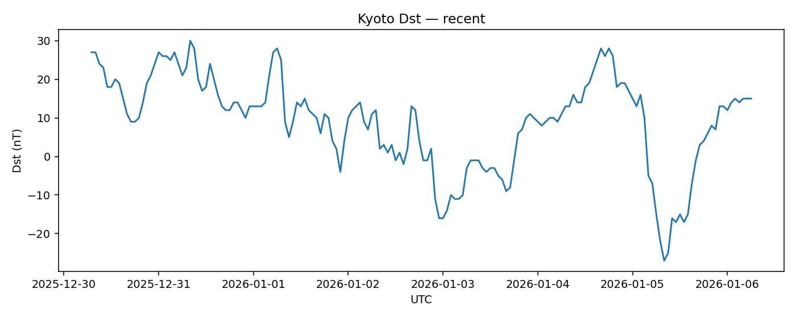{width=100%}

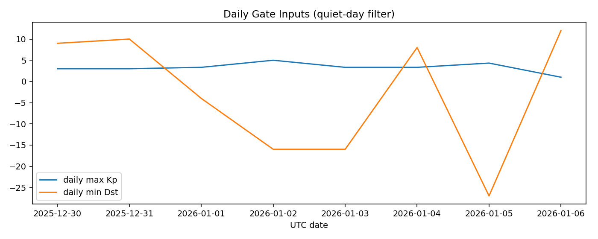{width=100%}

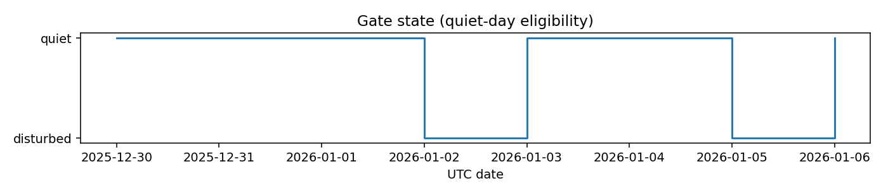{width=100%}

---

# Step 2 — Earth rotation / orientation (EOP)

::: {.callout-note}
**Job:** Detect unusual behavior in Earth rotation/orientation *relative to baseline*.

**What matters here:**
- Robust z-scores of LOD and polar-motion speed (not raw “wiggle plots”).
- Persistence (multi-day behavior), not a single spike.
:::

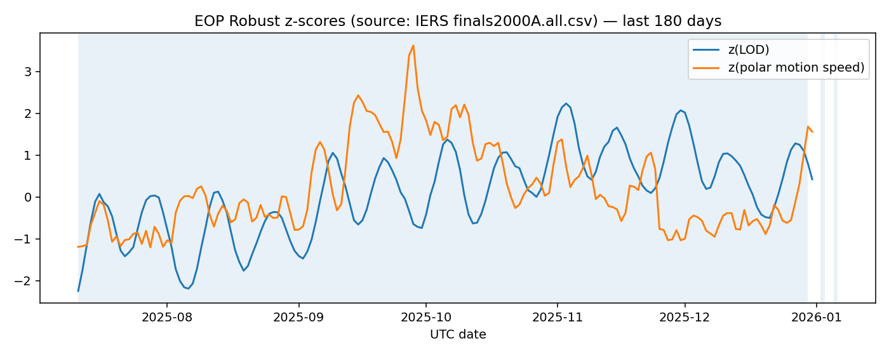{width=100%}

{width=100%}

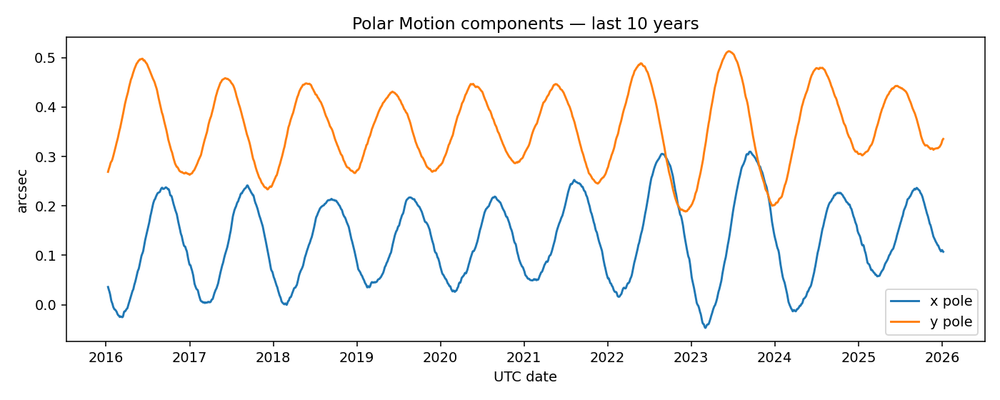{width=100%}

---

# Step 3 — Mass distribution proxy (C20 — lagged)

::: {.callout-note}
**Job:** Slow confirmatory channel (lagged). This is not real-time.
:::

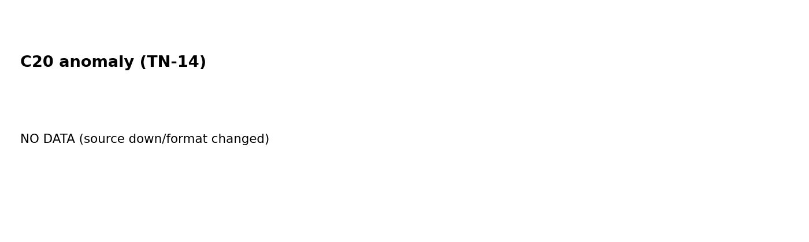{width=100%}

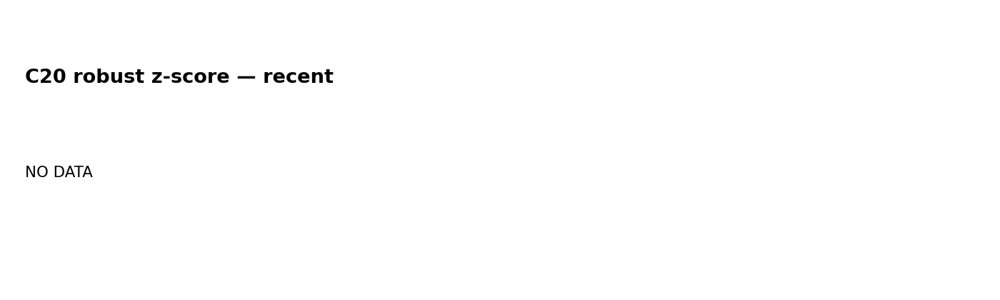{width=100%}

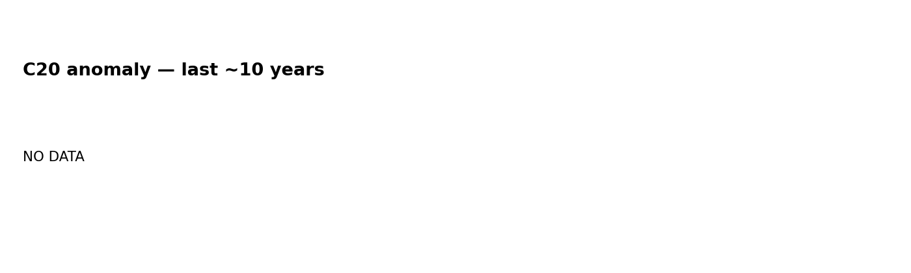{width=100%}

---

# Step 4 — Ground magnetic field residuals (multi-station)

::: {.callout-note}
**Job:** Station-normalized magnetic anomalies (robust z-scores), not raw field intensity.
:::

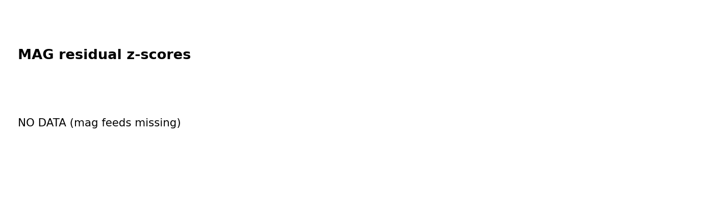{width=100%}

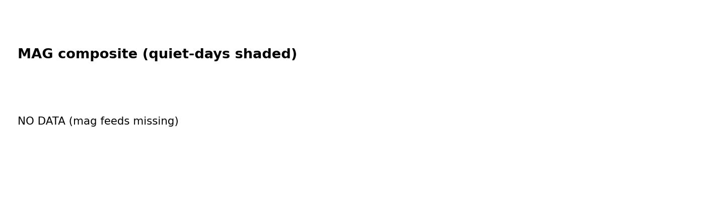{width=100%}

---

# Step 5 — Inference layer (coherence + watch score)

::: {.callout-important}
**Job:** Only after Step 1 is quiet do we interpret cross-channel agreement.
:::

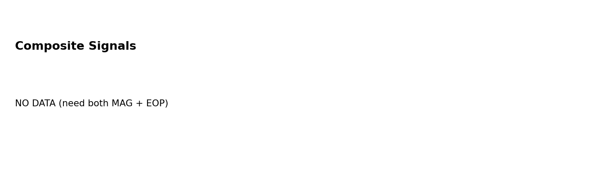{width=100%}
{width=100%}
{width=100%}

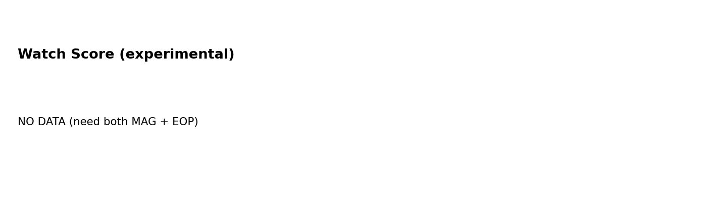{width=100%}

---

# Falsifiers (null-hypothesis wins)

::: {.callout-important}
This framing loses plausibility if:

1. Magnetometer anomalies consistently coincide with disturbed gate conditions (solar forcing explains them).
2. Multi-station magnetic coherence does not appear on quiet days.
3. EOP anomalies do not co-occur with magnetic coherence beyond chance.
4. Any “trend” disappears when you extend baselines to multi-year history.
:::
