

## 1) Space-weather gate (confound filter)

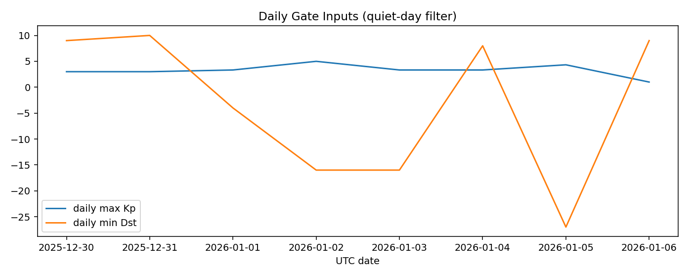{width=100%}

::: {.columns}
::: {.column width="50%"}
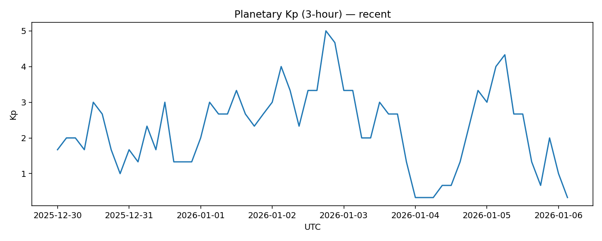{width=100%}
:::
::: {.column width="50%"}
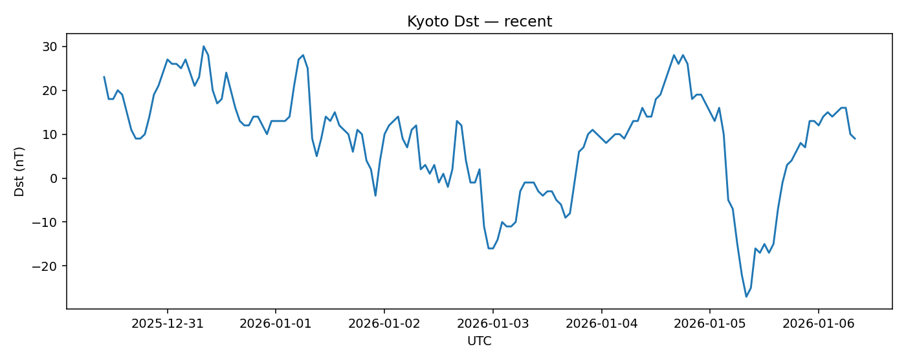{width=100%}
:::
:::

*(Optional context)*  
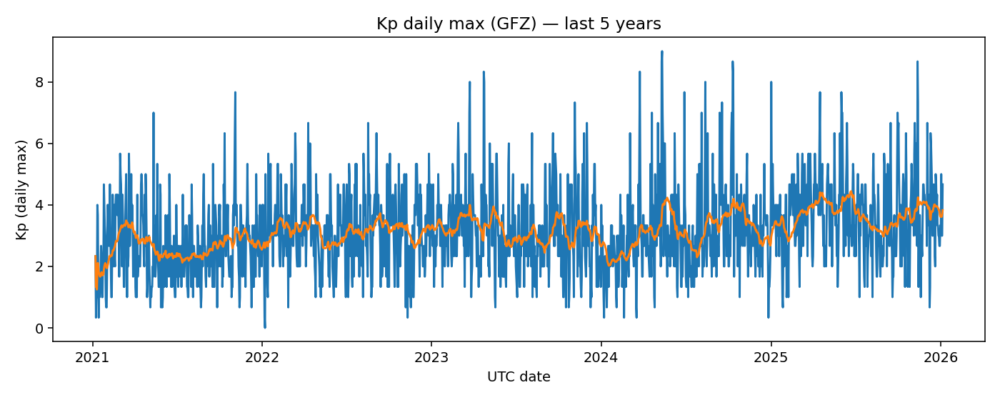{width=100%}

## 2) Earth orientation parameters (EOP)

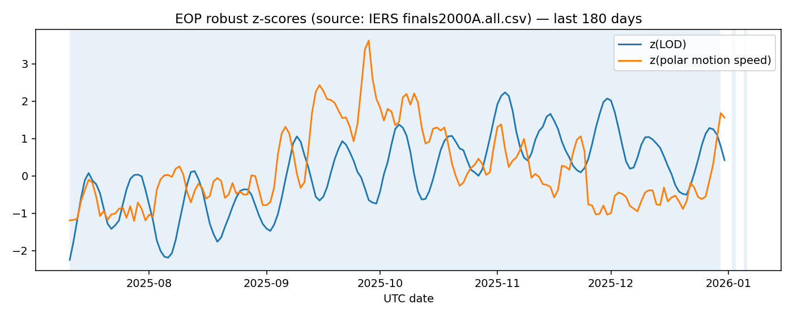{width=100%}

::: {.columns}
::: {.column width="50%"}
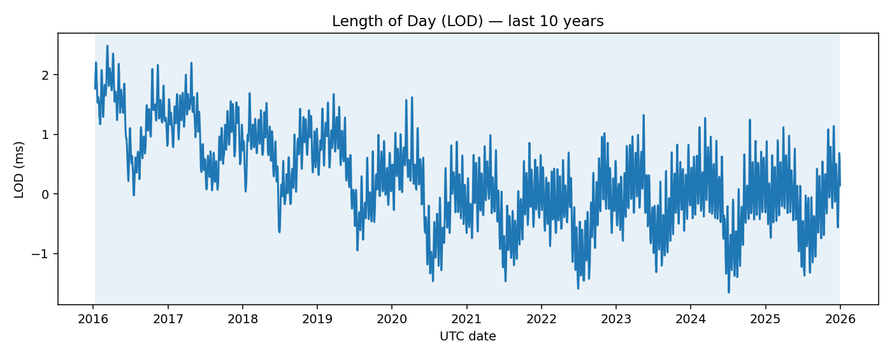{width=100%}
:::
::: {.column width="50%"}
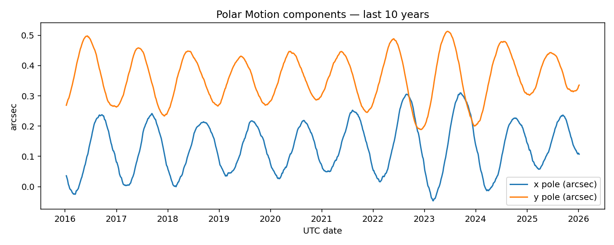{width=100%}
:::
:::

## 3) Mass-distribution proxy (C20; lagged)

::: {.columns}
::: {.column width="50%"}
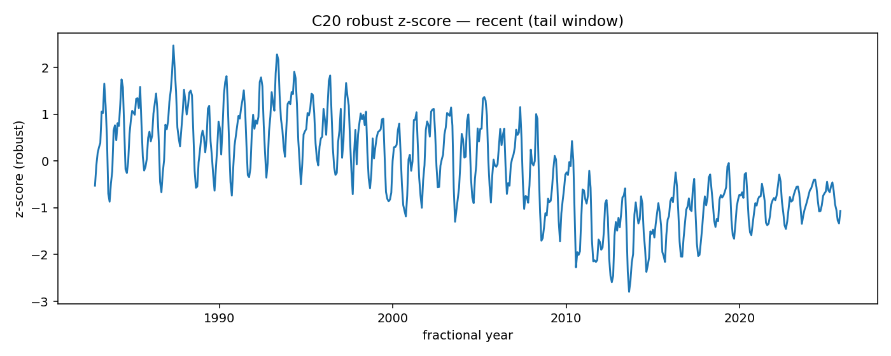{width=100%}
:::
::: {.column width="50%"}
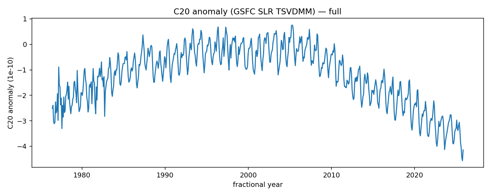{width=100%}
:::
:::

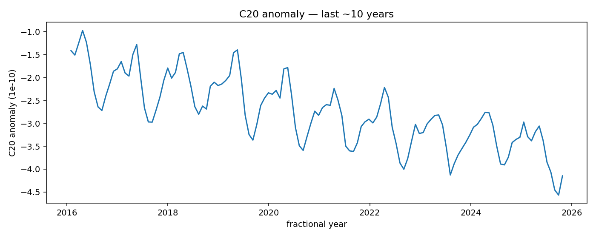{width=100%}

## 4) Magnetic-field residuals (ground stations)

::: {.columns}
::: {.column width="50%"}
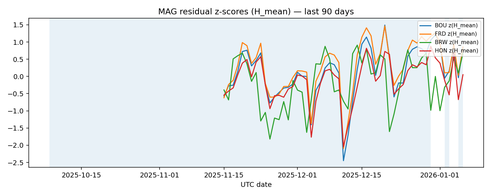{width=100%}
:::
::: {.column width="50%"}
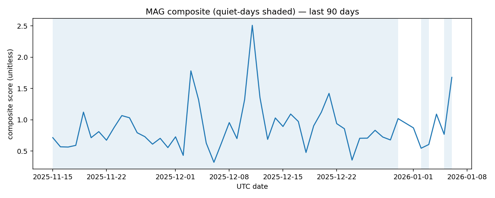{width=100%}
:::
:::

## Step 5 — Cross-channel coherence + watch score (experimental)

::: {.callout-important}
**Read this section in order:**
1) **Scatter (quiet days):** do MAG and EOP co-move at all?
2) **Rolling coherence (quiet days):** does that relationship persist?
3) **Composites:** time-aligned view.
4) **Watch score:** gated summary number (still experimental).
:::

{width=100%}

{width=100%}

{width=100%}

{width=100%}
